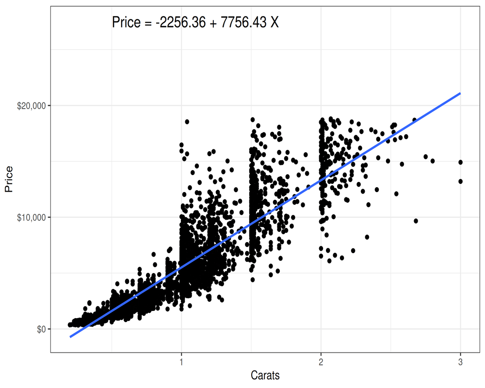
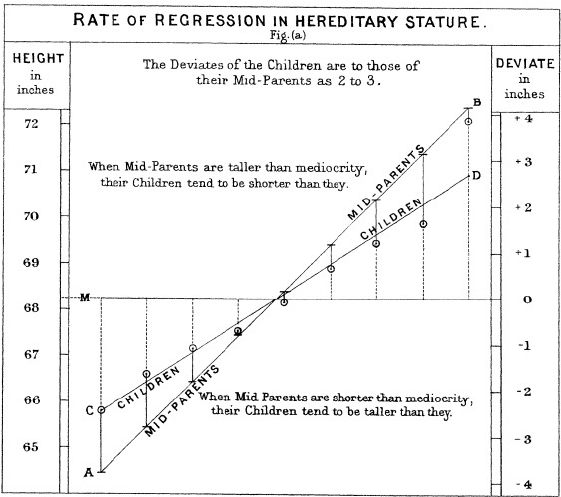
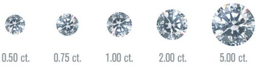
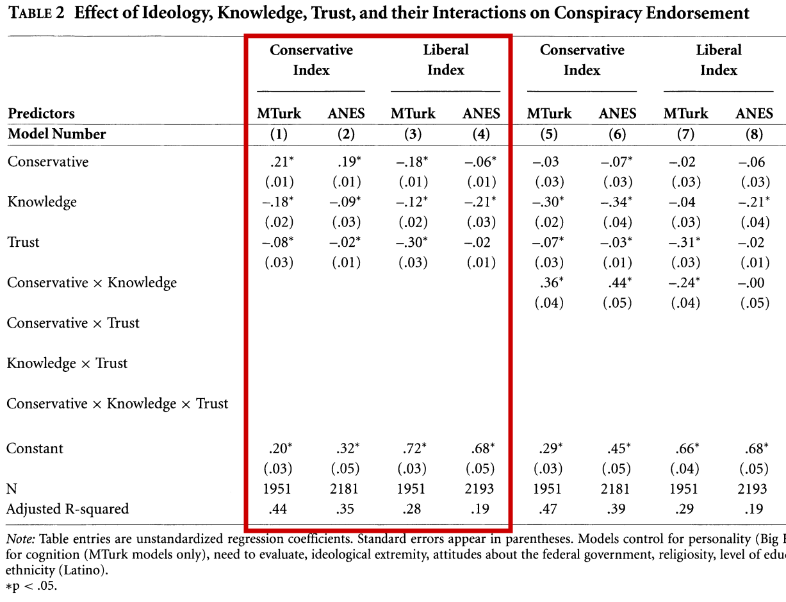

## Today's Agenda {background-image="Images/background-data_blue_v4.png" .center}

```{r}
library(tidyverse)
library(readxl)
library(kableExtra)
library(modelsummary)
library(modelr)
library(ggeffects)

wdi <- read_excel("../../DATA/2026-Spring/WDI/Lectures/World_Development_Indicators-2023_data-WORKING.xlsx", na = "NA")
```

<br>

::: {.r-fit-text}

**Ordinary Least Squares (OLS) Regression**

- Interpreting and evaluating OLS regressions

:::

<br>

::: r-stack
Justin Leinaweaver (Spring 2026)
:::

::: notes
Prep for Class

1. Check Canvas submissions AND plug in guesses into code below

2. Update presidential results (if needed)

3. NEXT TIME UPDATE THE FOLLOWING WITH THE NEW DATA IN THE ASSIGNMENT

<br>

Today we move from our general intuitions of summarizing a relationship with a line to the more nuts and bolts of OLS regression

<br>

**IMPORTANT**: I cannot emphasize this enough, none of this works unless you keep up with the assigned readings

- My slides today CANNOT be your introduction to OLS if you hope to develop these skills

- At worst, today's class work should be your THIRD journey into OLS counting the Wheelan reading, the reading for today and our work in class on Monday

<br>

If you do the work, I promise that each time you go through the material it will make more sense.

:::


## {background-image="Images/background-data_blue_v4.png" .center .smaller}

:::: {.columns}

::: {.column width="65%"}

```{r, fig.retina=3, fig.asp=.9, fig.align='center', fig.width = 6, cache=FALSE}
d_test <- tibble(
  x1 = c(2, 3, 4, 5, 6),
  y1 = c(3, 2, 4, 3, 5)
)

guesses <- tribble(
  ~Student, ~Alpha, ~Beta,
  #"OLS", 1.4, .5,
  "Brooklyn", 2, .5,
  "Elton", 1.4, .5,
  "Graham", 1.5, .5,
  # "Antonio", 0, .01,
  "Hallee", 1.5, .5,
  "Sara", 1.4, .5,
  "Tahrea", 1.5, .5,
  # "Alena", 0, .01,
  # "Audrey", 0, .01,
  # "Meyer", 0, .01,
  "Emma", .5, .5,
  "Lux", 1.4, .5,
  # "Abby", 0, .01,
  "Mckenzie", .5, 1.5,
  "Yevheniia", 1.4, .5
)

guesses2 <- guesses |>
  select(-Student)

# ggplot(data = d_test, aes(x = x1, y = y1)) + 
#   geom_point(size = 3) +
#   geom_abline(data = guesses, aes(slope = Beta, intercept = Alpha), color = "darkgrey") +
#   #geom_abline(slope = .5, intercept = 1.4, linewidth = 1.5) +
#   theme_bw() +
#   labs(x = "Predictor Variable (X)", y = "Outcome Variable (Y)", title = "Class Estimates BY HAND") +
#   scale_x_continuous(limits = c(.25, 9), breaks = 0:9) +
#   scale_y_continuous(limits = c(.25, 7), breaks = 1:7)

ggplot(data = d_test, aes(x = x1, y = y1)) + 
  geom_point(size = 3) +
  #geom_abline(data = guesses2, aes(slope = Beta, intercept = Alpha), color = "grey", linewidth=.25) +
  geom_abline(data = guesses, aes(slope = Beta, intercept = Alpha)) +
  gganimate::transition_states(Student, state_length = 5) +
  #geom_abline(slope = .5, intercept = 1.4, linewidth = 1.5) +
  theme_bw() +
  labs(x = "Predictor Variable (X)", y = "Outcome Variable (Y)", 
       title = "Estimating a Line of Best Fit (BY HAND): {closest_state}") +
  scale_x_continuous(limits = c(.25, 9), breaks = 0:9) +
  scale_y_continuous(limits = c(.25, 7), breaks = 1:7)

#  gganimate::shadow_wake(wake_length = .1)
```

:::

::: {.column width="35%"}
```{r, fig.retina=3, fig.asp=.65, fig.align='center', fig.width = 7, cache=FALSE}
# d_test |>
#   mutate(
#     Prediction = 1 + .5 * x1,
#     Residual = y1 - Prediction,
#     Squared = Residual^2
#   ) |>
#   summarize(
#     RSS = sum(Squared)
#   )

guesses |>
  group_by(Student) |>
  mutate(
    RSS = sum((d_test$y1 - (Alpha + Beta * d_test$x1))^2)
  ) |>
  arrange(RSS) |>
  kbl(align = c("l", "c", "c", "c")) |>
  kable_styling(bootstrap_options = c("striped", "hover", "condensed"), font_size = 20)
```
:::

::::

::: notes

For today I challenged each of you to draw us a line of best fit using only a ruler.

- **How did that go?**

<br>

NOTE that my RSS values may differ slightly from yours.

- You used a ruler, and I used R

<br>

Some of the class had trouble calculating the RSS.

- **Is everybody clear on summing the squared errors?**

<br>

**SLIDE**: The process

:::


## The Line of Best Fit? {background-image="Images/background-data_blue_v4.png" .center}

```{r, fig.retina=3, fig.asp=.65, fig.align='center', fig.width = 7, cache=FALSE}
d_test <- tibble(
  x1 = c(2, 3, 4, 5, 6),
  y1 = c(3, 2, 4, 3, 5)
)

set.seed(345)

d_random <- tibble(
  slope1 = rnorm(n = 10, mean = .5, sd = .02),
  intercept1 = rnorm(n = 10, mean = 1.3, sd = .25),
)

ggplot(data = d_test, aes(x = x1, y = y1)) + 
  geom_point(size = 3) +
  #geom_abline(data = d_random, aes(slope = slope1, intercept = intercept1), color = "darkgrey") +
  geom_abline(data = d_random, aes(slope = slope1, intercept = intercept1), color = RColorBrewer::brewer.pal(n = 10, name = "Set3")) +
  scale_x_continuous(limits = c(.25, 9), breaks = 0:9) +
  scale_y_continuous(limits = c(.25, 7), breaks = 1:7) +
  theme_bw() +
  labs(x = "Predictor Variable (X)", y = "Outcome Variable (Y)") +
  annotate("text", x = .5, y = seq(6.8, 3.5, length.out = 5), hjust = 0, label = paste0("Y = ", round(d_random$intercept1[1:5], 2), " + ", round(d_random$slope1[1:5], 2), "?"), size = 4) +
  annotate("text", x = 7.5, y = seq(4, .7, length.out = 5), hjust = 0, label = paste0("Y = ", round(d_random$intercept1[6:10], 2), " + ", round(d_random$slope1[6:10], 2), "?"), size = 4)

```

::: notes

In a sense, what we are doing here is mimicking the logic of a maximum likelihood approach.

- Taken to the extreme, we could fit a HUGE number of lines and simply keep the one with the least squared error

<br>

**SLIDE**: The actual line of best fit

:::


## OLS: The Line of Best Fit {background-image="Images/background-data_blue_v4.png" .center}

```{r, fig.retina=3, fig.asp=.65, fig.align='center', fig.width = 7, cache=TRUE}
d_test <- tibble(
  x1 = c(2, 3, 4, 5, 6),
  y1 = c(3, 2, 4, 3, 5)
)

res1 <- lm(data = d_test, y1 ~ x1)

d_preds <- tibble(
  x1 = 0:9
) |>
  add_predictions(res1)

d_test2 <- d_test |>
  add_predictions(res1) |>
  add_residuals(res1)

# d_test2 |>
#   summarize(
#     RSS = sum(resid^2)
#   )

ggplot(data = d_test2, aes(x = x1, y = y1)) + 
  geom_line(data = d_preds, aes(x = x1, y = pred), color = "darkblue") +
  annotate("segment", x = d_test2$x1, xend = d_test2$x1, y = d_test2$y1, yend = d_test2$pred, color = "red") +
  geom_point(size = 3) +
  scale_x_continuous(breaks = 0:9) +
  scale_y_continuous(limits = c(.25, 7), breaks = 1:7) +
  theme_bw() +
  labs(x = "Predictor Variable (X)", y = "Outcome Variable (Y)") +
  annotate("text", x = .5, y = 6.5, hjust = 0, label = "Y = 1.4 + 0.5 X", color = "darkblue", size = 6) +
  annotate("text", x = .5, y = 5.5, hjust = 0, label = "RSS = 2.7", color = "red", size = 6) +
  annotate("text", x = 1.7:5.7, y = c(2.6, 2.4, 3.6, 3.4, 4.6), label = round(d_test2$resid, 1), color = "red")
```

::: notes

Using some simple math I can tell you this is the line of best fit for this data.

- **So, how did you do? How close did you get with eye-balling it?**

<br>

This line is a HUGE improvement over the three we tried in class on Monday

- RSS dropped from 6.75 to 6 to 4.5 and now all the way down to 2.7!

- The residuals are all similar in size and distributed above and below the line

- **Does all of that make sense?**

<br>

Let's use the line to make some predictions

- **What is the change in Y predicted by our model for EACH change in X?**

    - (0.5)

- **What is the predicted value of Y if X equals five?**

    - (3.9)

<br>

Ok, so, why go to all this trouble of fitting and evaluating a line in order to summarize the relationship between two variables?

- **SLIDE**: Let's answer that question with data!

:::


## {background-image="Images/background-data_blue_v4.png" .center}

::: {.r-fit-text}
**Describing the Relationship: Diamond Price and Size**
:::

```{r, fig.align = 'center', fig.asp=.7, fig.width = 7, cache=TRUE}
cor1 <- round(cor(diamonds$carat, diamonds$price), 2)

diamonds |>
  slice_sample(prop = .1) |>
  ggplot(aes(x = carat, y = price)) +
  geom_point(alpha = .05) +
  theme_bw() +
  labs(x = "Carats", y = "Price",
       title = paste0("Diamond size and price are highly correlated (", cor1, ")")) +
  scale_y_continuous(labels = scales::dollar_format()) +
  coord_cartesian(xlim = c(0,4))
```

::: notes

As you well know, the diamonds dataset includes details on 54k+ diamonds in terms of their characteristics and estimated prices

<br>

From our bivariate analyses we discovered that:

- Bigger diamonds are typically more expensive, and

- There is a strong linear correlation between the two variables

<br>

While these two conclusions are useful, they are also quite limited in a practical sense

<br>

FIRST, in this plot I'm only showing you ten percent of the data so it doesn't get overwhelming
    
- e.g. 5 thousand observations

- A summary method that requires hiding 90% of the observations isn't a great tool for us

<br>

SECOND, we can't use these tools to easily answer specific questions

- **SLIDE**: For example...
    
:::


## {background-image="Images/background-data_blue_v4.png" .center}

**How much more should we expect to pay in order to move from a 1.5 carat to a 2.5 carat diamond?**

```{r, fig.align = 'center', fig.asp=.7, fig.width = 6, cache=FALSE}
range1 <- range(diamonds$price[diamonds$carat == 1.5])
range2 <- range(diamonds$price[diamonds$carat == 2.5])

diamonds |>
  slice_sample(prop = .1) |>
  ggplot(aes(x = carat, y = price)) +
  geom_point(alpha = .05) +
  theme_bw() +
  labs(x = "Carats", y = "Price") +
  scale_y_continuous(labels = scales::dollar_format()) +
  coord_cartesian(xlim = c(0,4)) +
  annotate("segment", x = 1.5, xend = 1.5, y = range1[1], yend = range1[2], color = "blue", arrow = arrow(angle = 90, length = unit(0.1, "inches"), ends = "both")) +
  annotate("segment", x = 2.5, xend = 2.5, y = range2[1], yend = range2[2], color = "blue", arrow = arrow(angle = 90, length = unit(0.1, "inches"), ends = "both"))
```

::: notes

Now that we have access to real diamond prices for 53k examples, it MUST be possible to answer simple questions like this.

<br>

**How could we use descriptive statistics to answer this question?**

- (**SLIDE**: Results)

:::


## {background-image="Images/background-data_blue_v4.png" .center}

**How much more should we expect to pay in order to move from a 1.5 carat to a 2.5 carat diamond?**

```{r, echo=TRUE}
# Make subsets
diamonds1_5 <- subset(diamonds, carat == 1.5)
diamonds2_5 <- subset(diamonds, carat == 2.5)
```

<br>

```{r, echo=TRUE}
# Summarize
summary(diamonds1_5$price)
```

<br>

```{r, echo=TRUE}
summary(diamonds2_5$price)
```

::: notes

*Step through approach on slide*

<br>

**Ok, based on these results what is our answer to the question?**

<br>

**Is this a good answer? Why or why not?**

- e.g. Specific? Easily understandable?

<br>

The FIRST big problem with trying to answer our question with descriptive stats is that our choice of comparison is somewhat arbitrary

- There isn't really a robust way to defend our choice of which parts to compare

- e.g. compare means, medians, IQRs?

<br>

In this case comparing the means and medians shows an increase in price with weight, but comparing the maximums doesn't

- Is one of these more "true" or "correct" than the others?

<br>

**How could we use a visualization to answer this question?**

- (**SLIDE**: Result)

:::


## {background-image="Images/background-data_blue_v4.png" .center}

**How much more should we expect to pay in order to move from a 1.5 carat to a 2.5 carat diamond?**

```{r, echo=FALSE, fig.align='center', fig.asp=.618, cache=TRUE}
# Box plots
diamonds |>
  mutate(
    class2 = case_when(
      carat == 1.5 ~ "1.5 carats",
      carat == 2.5 ~ "2.5 carats",
      TRUE ~ NA_character_
    )
  ) |>
  na.omit() |>
  ggplot(aes(x = price, fill = class2)) +
  geom_boxplot() +
  theme_bw() +
  scale_x_continuous(labels = scales::dollar_format()) +
  labs(x = "Diamond Prices", y = "Density", fill = "")
```

::: notes

**Ok, based on these results what is our answer to the question?**

<br>

**Is this a good answer? Why or why not?**

- e.g. Specific? Easily understandable?

<br>

This still doesn't solve the arbitrariness problem

- These boxes are definitely different, but by how much?

<br>

IN ADDITION, these approaches don't give us an easy way to describe our uncertainty in the comparisons

- In other words, how confident should we be in these estimates of the mean or median?

- Are these groups comparable to each other?

<br>

**SLIDE**: And the sample size problem is a BIG one

:::


## {background-image="Images/background-data_blue_v4.png" .center}

**How much more should we expect to pay in order to move from a 1.5 carat to a 2.5 carat diamond?**

```{r, echo=FALSE, fig.align='center', fig.asp=.618, cache=TRUE}
# Box plots
diamonds |>
  mutate(
    class2 = case_when(
      carat == 1.5 ~ "1.5 carats",
      carat == 2.5 ~ "2.5 carats",
      TRUE ~ NA_character_
    )
  ) |>
  na.omit() |>
  ggplot(aes(x = price, fill = class2)) +
  geom_boxplot(varwidth = TRUE) +
  theme_bw() +
  scale_x_continuous(labels = scales::dollar_format()) +
  labs(x = "Diamond Prices", y = "Density", fill = "")
```

::: notes

```{r, echo=TRUE}
# Count the observations
nrow(diamonds1_5)

nrow(diamonds2_5)
```

<br>

Here I am scaling the width of the boxes by the size of each group

- The 1.5 carat group is only 793 diamonds out of 53k (e.g. 1% of the sample)

- The 2.5 carat group is only 17 diamonds!!!

- We probably shouldn't be confident drawing conclusions about the relationship between diamond weight and value using 1% of the sample!

<br>

**SLIDE**: Regression can help us with all three issues!

:::


## {background-image="Images/background-data_blue_v4.png" .center}

::: {.r-fit-text}
**An OLS Regression Analysis of Diamond Prices**
:::

{style="display: block; margin: 0 auto"}

```{r, fig.align = 'center', fig.asp=.75, fig.width = 8, eval=TRUE}
res1 <- lm(data = diamonds, price ~ carat)
# summary(res1)
# res1
# diamonds |>
#   slice_sample(prop = .1) |>
#   ggplot(aes(x = carat, y = price)) +
#   geom_point(alpha = 1) +
#   geom_smooth(method = "lm", se = FALSE) +
#   theme_bw() +
#   labs(x = "Carats", y = "Price") +
#   scale_y_continuous(labels = scales::dollar_format()) +
#   annotate("text", x = .5, y = 27500, hjust = 0, label = paste0("Price = ", round(coef(res1)[[1]], 2), " + ", round(coef(res1)[[2]], 2), " (Carats)"), size = 5)

## What would an animated version look like?

# set.seed(345)
# 
# diamonds2 <- diamonds |>
#   slice_sample(prop = .1)
# 
# diamonds2 |>
#   ggplot(aes(x = carat, y = price)) +
#   geom_point(alpha = 1) +
#   geom_smooth(method = "lm", se = FALSE) +
#   theme_bw() +
#   labs(x = "Carats", y = "Price") +
#   scale_y_continuous(labels = scales::dollar_format()) +
#   annotate("text", x = .5, y = 27500, hjust = 0, label = paste0("Price = ", round(coef(res1)[[1]], 2), " + ", round(coef(res1)[[2]], 2), "(Carats)"), size = 5)
# 
# ggsave(filename = "Images/10_2-gifpart1.png", dpi = 320, width = 2400, height = 1600, units = "px")
# 
# diamonds2 |>
#   ggplot(aes(x = carat, y = price)) +
#   geom_point(alpha = .5) +
#   geom_smooth(method = "lm", se = FALSE) +
#   theme_bw() +
#   labs(x = "Carats", y = "Price") +
#   scale_y_continuous(labels = scales::dollar_format()) +
#   annotate("text", x = .5, y = 27500, hjust = 0, label = paste0("Price = ", round(coef(res1)[[1]], 2), " + ", round(coef(res1)[[2]], 2), "(Carats)"), size = 5)
# 
# ggsave(filename = "Images/10_2-gifpart2.png", dpi = 320, width = 2400, height = 1600, units = "px")
# 
# diamonds2 |>
#   ggplot(aes(x = carat, y = price)) +
#   geom_point(alpha = .25) +
#   geom_smooth(method = "lm", se = FALSE) +
#   theme_bw() +
#   labs(x = "Carats", y = "Price") +
#   scale_y_continuous(labels = scales::dollar_format()) +
#   annotate("text", x = .5, y = 27500, hjust = 0, label = paste0("Price = ", round(coef(res1)[[1]], 2), " + ", round(coef(res1)[[2]], 2), "(Carats)"), size = 5)
# 
# ggsave(filename = "Images/10_2-gifpart3.png", dpi = 320, width = 2400, height = 1600, units = "px")
# 
# diamonds2 |>
#   ggplot(aes(x = carat, y = price)) +
#   geom_point(alpha = .125) +
#   geom_smooth(method = "lm", se = FALSE) +
#   theme_bw() +
#   labs(x = "Carats", y = "Price") +
#   scale_y_continuous(labels = scales::dollar_format()) +
#   annotate("text", x = .5, y = 27500, hjust = 0, label = paste0("Price = ", round(coef(res1)[[1]], 2), " + ", round(coef(res1)[[2]], 2), "(Carats)"), size = 5)
# 
# ggsave(filename = "Images/10_2-gifpart4.png", dpi = 320, width = 2400, height = 1600, units = "px")
# 
# diamonds2 |>
#   ggplot(aes(x = carat, y = price)) +
#   geom_point(alpha = .06) +
#   geom_smooth(method = "lm", se = FALSE) +
#   theme_bw() +
#   labs(x = "Carats", y = "Price") +
#   scale_y_continuous(labels = scales::dollar_format()) +
#   annotate("text", x = .5, y = 27500, hjust = 0, label = paste0("Price = ", round(coef(res1)[[1]], 2), " + ", round(coef(res1)[[2]], 2), "(Carats)"), size = 5)
# 
# ggsave(filename = "Images/10_2-gifpart5.png", dpi = 320, width = 2400, height = 1600, units = "px")
# 
# diamonds2 |>
#   ggplot(aes(x = carat, y = price)) +
#   geom_point(alpha = .03) +
#   geom_smooth(method = "lm", se = FALSE) +
#   theme_bw() +
#   labs(x = "Carats", y = "Price") +
#   scale_y_continuous(labels = scales::dollar_format()) +
#   annotate("text", x = .5, y = 27500, hjust = 0, label = paste0("Price = ", round(coef(res1)[[1]], 2), " + ", round(coef(res1)[[2]], 2), "(Carats)"), size = 5)
# 
# ggsave(filename = "Images/10_2-gifpart6.png", dpi = 320, width = 2400, height = 1600, units = "px")
# 
# diamonds2 |>
#   ggplot(aes(x = carat, y = price)) +
#   geom_point(alpha = .015) +
#   geom_smooth(method = "lm", se = FALSE) +
#   theme_bw() +
#   labs(x = "Carats", y = "Price") +
#   scale_y_continuous(labels = scales::dollar_format()) +
#   annotate("text", x = .5, y = 27500, hjust = 0, label = paste0("Price = ", round(coef(res1)[[1]], 2), " + ", round(coef(res1)[[2]], 2), "(Carats)"), size = 5)
# 
# ggsave(filename = "Images/10_2-gifpart7.png", dpi = 320, width = 2400, height = 1600, units = "px")
# 
# diamonds2 |>
#   ggplot(aes(x = carat, y = price)) +
#   geom_point(alpha = 0) +
#   geom_smooth(method = "lm", se = FALSE) +
#   theme_bw() +
#   labs(x = "Carats", y = "Price") +
#   scale_y_continuous(labels = scales::dollar_format()) +
#   annotate("text", x = .5, y = 27500, hjust = 0, label = paste0("Price = ", round(coef(res1)[[1]], 2), " + ", round(coef(res1)[[2]], 2), "(Carats)"), size = 5)
# 
# ggsave(filename = "Images/10_2-gifpart8.png", dpi = 320, width = 2400, height = 1600, units = "px")
# 
# library(gifski)
# 
# gifski(png_files = c("Images/10_2-gifpart1.png","Images/10_2-gifpart2.png","Images/10_2-gifpart3.png","Images/10_2-gifpart4.png","Images/10_2-gifpart5.png","Images/10_2-gifpart6.png","Images/10_2-gifpart7.png","Images/10_2-gifpart8.png"), gif_file = "Images/10_2-diamonds_OLS.gif", width = 1000, height = 800, delay = 1)
```

::: notes

Regression analysis addresses all of these problems by producing a single line that is influenced by EVERY data point and represents the relationship of interest

<br>

This simple line summarizes all of that data and let's us answer any question with specificity

- On average, every one unit increase in diamond size is associated with an increase in the price of $7.8k

- On average, a 1.5 carat diamond should sell for approximately $`r round(predict(res1, newdata = data.frame(carat=1.5)), 2)`

- On average, a 2.5 carat diamond should sell for approximately $`r round(predict(res1, newdata = data.frame(carat=2.5)), 2)`

<br>

**Is everybody clear on how regression analysis can be a really useful summary of a relationship between two variables?**

<br>

**Per the readings, how does OLS find this line of best fit?**

- (**SLIDE**: the same way you did!)

:::


## OLS Minimizes the RSS {background-image="Images/background-data_blue_v4.png" .center}

```{r, fig.retina=3, fig.align='center', fig.width=8, fig.asp=0.618, cache=TRUE}
model1 <- lm(data = diamonds, price ~ carat)
preds1 <- ggeffects::ggpredict(model1, "carat")

set.seed(7)
d2 <- diamonds |>
  slice_sample(prop = .005)

d2 |>
  modelr::add_predictions(model1) |> 
  ggplot(aes(x = carat)) +
  geom_point(aes(y = price)) +
  geom_ribbon(data = preds1, aes(x = x, ymin = conf.low, ymax = conf.high), fill = "lightblue") +
  geom_line(data = preds1, aes(x = x, y = predicted), color = "royalblue1", size = 1.2) +
  geom_segment(aes(xend = carat, y = price, yend = pred), color = "red") +
  theme_bw() +
  labs(x = "Carats", y = "Price") +
  coord_cartesian(ylim = c(0, 19000), xlim = c(0,4)) +
  scale_y_continuous(labels = scales::dollar_format())
```

::: notes

OLS finds the line that minimizes the squared residuals of ALL THE POINTS.

- The name is in the acronym: ordinary least squares

- In essence, this attempts to draw a line through the "middle" of the relationship

<br>

In a sense, OLS is a procedure for finding the mean of Y for different levels of X

- That means you can think of the OLS line like representing the averages for the relationship

<br>

**Is everybody clear on this?**

<br>

So, why should we prefer a summary line that approximates the mean?

- **SLIDE**: Quick tangent into the word "regression"!

:::


## 'Regression to the mean' {background-image="Images/background-data_blue_v4.png" .center}

{style="display: block; margin: 0 auto"}

::: notes

Asking about "regression to the mean" means exploring the work of the 19th century statistician, Sir Francis Galton.

<br>

The results of a famous 1886 experiment

- Gathers the heights of 930 children and their parents

- The horizontal line here is the average height of the sample and the y-axis labels on the right show the differences to the average

<br>

The x-axis is organized by the heights of the parents

- So, the shortest parents are on the left of the line marked "A" and the tallest build to the right

- The children of those parents are plotted on the C line

<br>

Galton observed that:

- Parents shorter than average had children taller than them but also still shorter than average

- Parents taller than average had children shorter than them, but still taller than average

<br>

Galton explained this finding as "regression to the mean"

- **Can everybody see this in the plot?**

<br>

**SLIDE**: Why does height show this regression to the mean?

:::


## 'Regression to the mean' {background-image="Images/background-data_blue_v4.png" .center}

<br>

:::: {.columns}

::: {.column width="50%"}

<br>

**Determinants of Height**

- Polygenic inheritance

- Environmental influences

:::

::: {.column width="50%"}


:::

::::

::: notes

Qualities like your height are actually the result of adding together a bunch of different factors ([Link1](https://www.sciencedirect.com/science/article/abs/pii/S1570677X09000793), [Link2](https://www.nature.com/articles/s41598-020-64883-8))

<br>

Scientists estimate as much as 80% of height is genetic, HOWEVER

- Height is considered a polygenic trait, meaning many genes, each with a small effect, contribute to overall height rather than a single gene controlling it.

- That also leaves as much as 20% of the variation explained by environmental factors

<br>

Extreme values of height, being MUCH taller than average or shorter, require all of these different factors to point the exact same way

- The odds are that your kids will share many, if not most, of your same factors but a few will likely be different just by chance

- Those few differences pull their height away from yours

<br>

**SLIDE**: Let me clarify this with a simulation

:::


## Let's Simulate an Experiment! {background-image="Images/background-data_blue_v4.png" .center}

:::: {.columns}
::: {.column width="50%"}
```{r, fig.align='center', fig.asp=1, fig.width=6, cache=TRUE}
# Set up
d_base <- tibble(
  obs = 1:100,
  current = 50
)

p1 <- ggplot(data = d_base, aes(x = current, y = obs)) +
  scale_x_continuous(limits = c(0, 100), breaks = seq(0, 100, 10), labels = c("", seq(10, 50, 10), seq(40, 10, -10), "")) +
  ggthemes::theme_tufte() +
  geom_vline(xintercept = seq(0, 100, 10), color = "white") +
  geom_vline(xintercept = 50, color = "white", linewidth = 1.4) +
  theme(panel.background = element_rect(fill = "springgreen3", colour = "springgreen3")) +
  geom_rect(xmin = -5, xmax = 0, ymin = -5, ymax = 105, fill = "white", color = "black") +
  geom_rect(xmin = 100, xmax = 105, ymin = -5, ymax = 105, fill = "white", color = "black") +
  labs(x = "", y = "") +
  scale_y_continuous(labels = NULL)

p1 +
  geom_point(data = d_base, size = 2.5, color = "red")
```
:::

::: {.column width="50%"}
```{r, fig.align='center', fig.asp=1, fig.width=6, cache=TRUE}
d_base |>
  mutate(
    current_f = factor(current, levels = seq(40,60, 1))
  ) |>
  ggplot(aes(x = current_f)) +
  geom_bar(width = .7) +
  theme_bw() +
  scale_x_discrete(drop = FALSE) +
  labs(x = "", y = "Count of Positions")
```
:::
::::

::: notes

*Idea taken from McElreath book*

<br>

Imagine we line up 100 people on the 50 yard line of a football field

- Each person gets a fair coin

- We will ask each person to flip the coin

    - Heads take one step to the right (+1)

    - Tails take one step to the left (-1)

<br>

On the left I have a picture of our hypothetical field and all 100 subjects

On the right I have a bar plot showing where on the field each person is now

<br>

### Questions on the set-up here?

<br>

Let's collect some guesses about the outcome of this experiment

<br>

**After 10 flips of the coin, how many of our 100 subjects will still be on the 50 yard line?**

- *ON BOARD*

:::


## Coin Flip 1 {background-image="Images/background-data_blue_v4.png" .center}

<br>

:::: {.columns}
::: {.column width="50%"}
```{r, fig.align='center', fig.asp=1, fig.width=6, cache=TRUE}
# Flip 1 coin
d1 <- d_base |>
  mutate(
    flip = sample(x = c(-1, 1), size = 100, prob = c(.5, .5), replace = TRUE),
    new = current + flip
  )

p1 +
  geom_point(data = d1, size = 2.5, color = "red", aes(x = new))
```
:::

::: {.column width="50%"}
```{r, fig.align='center', fig.asp=1, fig.width=6, cache=TRUE}
d1 |>
  mutate(
    new_f = factor(new, levels = seq(45,55, 1))
  ) |>
  ggplot(aes(x = new_f)) +
  geom_bar(width = .7) +
  theme_bw() +
  scale_x_discrete(drop = FALSE) +
  labs(x = "", y = "Count of Positions")
```
:::
::::

::: notes
After the first flip EVERYONE has moved away from the 50 yard line by one randomly selected step!

:::


## Coin Flip 2 {background-image="Images/background-data_blue_v4.png" .center}

<br>

:::: {.columns}
::: {.column width="50%"}
```{r, fig.align='center', fig.asp=1, fig.width=6, cache=TRUE}
# Flip again
d2a <- d1 |>
  mutate(
    current = new,
    flip = NULL,
    new = NULL
  )

d2 <- d2a |>
  mutate(
    flip = sample(x = c(-1, 1), size = 100, prob = c(.5, .5), replace = TRUE),
    new = current + flip
  )

p1 +
  geom_point(data = d2, size = 2.5, color = "red", aes(x = new))
```
:::

::: {.column width="50%"}
```{r, fig.align='center', fig.asp=1, fig.width=6, cache=TRUE}
d2 |>
  mutate(
    new_f = factor(new, levels = seq(45,55, 1))
  ) |>
  ggplot(aes(x = new_f)) +
  geom_bar(width = .7) +
  theme_bw() +
  scale_x_discrete(drop = FALSE) +
  labs(x = "", y = "Count of Positions")
```
:::
::::

::: notes
After two random steps we have about half the sample two steps away from the 50 yard line and half back on it!
:::


## Coin Flip 3 {background-image="Images/background-data_blue_v4.png" .center}

<br>

:::: {.columns}
::: {.column width="50%"}
```{r, fig.align='center', fig.asp=1, fig.width=6, cache=TRUE}
# Flip again
d3a <- d2 |>
  mutate(
    current = new,
    flip = NULL,
    new = NULL
  )

d3 <- d3a |>
  mutate(
    flip = sample(x = c(-1, 1), size = 100, prob = c(.5, .5), replace = TRUE),
    new = current + flip
  )

p1 +
  geom_point(data = d3, size = 2.5, color = "red", aes(x = new))
```
:::

::: {.column width="50%"}
```{r, fig.align='center', fig.asp=1, fig.width=6, cache=TRUE}
d3 |>
  mutate(
    new_f = factor(new, levels = seq(45,55, 1))
  ) |>
  ggplot(aes(x = new_f)) +
  geom_bar(width = .7) +
  theme_bw() +
  scale_x_discrete(drop = FALSE) +
  labs(x = "", y = "Count of Positions")
```
:::
::::

::: notes

Ok, third flip

<br>

Again, random flips have moved some further away from the 50 and a number have again returned closer!

<br>

**SLIDE**: Let's unpack what were' seeing here with simple counting
:::


## Coin Flip 3: Possible Paths {background-image="Images/background-data_blue_v4.png" .center}

<br>

:::: {.columns}
::: {.column width="50%"}
```{r, fig.retina=3, fig.align='center', fig.asp=1, fig.width=6, cache=TRUE}
# Flip again
p1 +
  geom_point(data = d3, size = 2.5, color = "red", aes(x = new))
```
:::

::: {.column width="25%"}
- H, T, T = -1
- T, H, T = -1
- T, T, H = -1
- H, H, T = +1
- H, T, H = +1
- T, H, H = +1
:::

::: {.column width="25%"}
- T, T, T = -3
- H, H, H = +3
:::
::::

::: notes
There are only eight possible outcomes from flipping a fair coin 3 times

- In six of these eight outcomes the flipper is only 1 step away from the starting point! (75%)

- In only two of the outcomes has a flipper moved three steps away

<br>

So, apply these percentages to any group of subjects and our expectation is that after three flips most are very close to the starting place!

<br>

**SLIDE**: Let's check four flips!
:::


## Coin Flip 4: Possible Paths {background-image="Images/background-data_blue_v4.png" .center .smaller}

<br>

:::: {.columns}
::: {.column width="40%"}
```{r, fig.retina=3, fig.align='center', fig.asp=1, fig.width=6, cache=TRUE}
# Flip again
d4a <- d3 |>
  mutate(
    current = new,
    flip = NULL,
    new = NULL
  )

d4 <- d4a |>
  mutate(
    flip = sample(x = c(-1, 1), size = 100, prob = c(.5, .5), replace = TRUE),
    new = current + flip
  )

p1 +
  geom_point(data = d4, size = 2.5, color = "red", aes(x = new))
```
:::

::: {.column width="20%"}
- T, H, T, H = 0
- H, T, H, T = 0
- H, T, T, H = 0
- H, H, T, T = 0
- T, H, H, T = 0
- T, T, H, H = 0
:::

::: {.column width="20%"}
- H, T, T, T = -2
- T, H, T, T = -2
- T, T, H, T = -2
- T, T, T, H = -2
- H, H, H, T = +2
- H, H, T, H = +2
- H, T, H, H = +2
- T, H, H, H = +2
:::

::: {.column width="20%"}
- T, T, T, T = -4
- H, H, H, H = +4
:::
::::

::: notes

Here we see the 16 ways a person could flip a coin four times.

- We expect 38% of our subjects (6/16) to end up back on the 50!

- All in that puts 88% of subjects (14/16) within 2 steps!

- Only 2 paths or 13% reach the extremes!

<br>

**SLIDE**: And check the bar plot!
:::


## Coin Flip 4 {background-image="Images/background-data_blue_v4.png" .center}

<br>

:::: {.columns}
::: {.column width="50%"}
```{r, fig.retina=3, fig.align='center', fig.asp=1, fig.width=6, cache=TRUE}
p1 +
  geom_point(data = d4, size = 2.5, color = "red", aes(x = new))
```
:::

::: {.column width="50%"}
```{r, fig.retina=3, fig.align='center', fig.asp=1, fig.width=6, cache=TRUE}
d4 |>
  mutate(
    new_f = factor(new, levels = seq(45,55, 1))
  ) |>
  ggplot(aes(x = new_f)) +
  geom_bar(width = .7) +
  theme_bw() +
  scale_x_discrete(drop = FALSE) +
  labs(x = "", y = "Count of Positions")
```
:::
::::

::: notes
And here we see the results of our experiment after flip 4.

- Adding together a bunch of small, randomly assigned changes means that extremes tend to counter each other

<br>

**SLIDE**: Let's jump ahead to flip 10!
:::


## Coin Flip 10 {background-image="Images/background-data_blue_v4.png" .center}

<br>

:::: {.columns}
::: {.column width="50%"}
```{r, fig.align='center', fig.asp=1, fig.width=6, cache=TRUE}
# Simulate 10 flips
repo10 <- vector("list", 10)

for (i in 1:10) {
  repo10[[i]] <- sample(x = c(-1, 1), size = 100, prob = c(.5, .5), replace = TRUE)
}

d10 <- d1

d10$current <- as_tibble(repo10, .name_repair = "unique") |>
  rowSums() + 50

p1 +
  geom_point(data = d10, size = 2.5, color = "red")
```
:::

::: {.column width="50%"}
```{r, fig.align='center', fig.asp=1, fig.width=6, cache=TRUE}
d10 |>
  mutate(
    current_f = factor(current, levels = seq(40,60, 1))
  ) |>
  ggplot(aes(x = current_f)) +
  geom_bar(width = .7) +
  theme_bw() +
  scale_x_discrete(drop = FALSE) +
  labs(x = "", y = "Count of Positions")
```
:::
::::

::: notes
The results will always be different given the random coin flips, but after ten flips we tend to see:

- 25-30% of cases on the 50 yard line

- 55% within 2 steps!

<br>

The key observation: When you add a bunch of small differences together there are more ways for them to stay near the average than near one of the extremes.

- The output of most complex systems in the natural world are more likely to produce values close to the "normal" than at the extremes.

:::


## 'Regression to the mean'{background-image="Images/background-data_blue_v4.png" .center}

```{r, echo = FALSE, fig.align = 'center', out.width = '66%'}

```

::: notes

THIS is what Galton found with his research into parent-child heights.

- The mix of factors that explain why someone is very tall or very short (e.g. the extreme values) are less likely than those that reproduce the average

- HENCE, tall parents more likely to have kids shorter than them

- HENCE, short parents more likely to have kids taller than them

<br>

Across tons of different processes in nature we typically see extreme observations followed by less extreme observations

- THIS is the power of regression.

- When trying to represent a relationship regression uses the logic of the mean to summarize the relationship

<br>

**Any questions on the intuition of why predicting the average is frequently useful for us?**

<br>

**SLIDE**: Why use OLS regression analyses?

:::


## Why use OLS regressions? {background-image="Images/background-data_blue_v4.png" .center}

<br>

**Basics**

- Quantifies the relationship between variables

- Uses **ALL** of the data

- Makes predictions with estimates of uncertainty

- Gives us criteria for evaluating the fit of the line

**Future Weeks**

- Can be adjusted for confounders (e.g. control variables), nonlinear relationships and different data structures

::: notes

**Any questions on these intuitions or what we've covered so far today?**

<br>

**SLIDE**: That brings us back to diamonds!

:::


## {background-image="Images/background-data_blue_v4.png" .center}

::: {.r-fit-text}
**An OLS Regression Analysis of Diamond Prices**
:::

<br>

:::: {.columns}

::: {.column width="50%"}
{style="display: block; margin: 0 auto"}
:::

::: {.column width="50%"}
```{r}
model1 <- lm(data = diamonds, price ~ carat)
predictions1 <- ggpredict(model1, terms = "carat")

modelsummary(list("Diamond Value" = model1), output = "gt",
             fmt = 2, 
             stars = c('*' = .05), 
             gof_omit = "IC|Log|F",
             coef_map = c("carat"= "Size (carats)", "(Intercept)" = "Constant")) |>
  gt::tab_style(style = list(
                  gt::cell_fill(color = 'white'),
                  gt::cell_text(size = "large")
  ), locations = gt::cells_body())
```
:::

::::

```{r, fig.align = 'center', fig.asp=.75, fig.width = 8, eval=TRUE}
res1 <- lm(data = diamonds, price ~ carat)
```

::: notes

So, now we have an OLS regression summarizing the relationship between diamond size and price

<br>

On the right I'm showing you a regression table

- This should be incredibly familiar to you if you've read any quantitative academic literature

- This is the standard way that regressions are communicated in academic journals

- THIS is how I will expect you to report regression results in reports for this class!

- The readings and the R regression handout on Canvas can help you do this

<br>

So, regression is an incredibly powerful tool for data analysis.

- It can be used to provide summaries, answer specific questions and to make predictions for the future

<br>

However, as we learned form our hands-on work Monday, just because you can draw a line through the data, DOESN'T mean it's a good summary!

- When you include a regression in a report for this class I am REQUIRING you to evaluate it using four steps

- Everybody TAKE NOTES on these as we go!

- **SLIDE**

:::


## Evaluating an OLS Regression {background-image="Images/background-data_blue_v4.png" .center}

**1. Is there a problem with missing data?**

<br>

:::: {.columns}
::: {.column width="50%"}

<br>

```{r, echo = TRUE}
# All observations
nrow(diamonds)
```

:::

::: {.column width="50%"}
```{r}
model3 <- lm(data = diamonds, price ~ carat)
predictions3 <- ggpredict(model3, terms = "carat")

modelsummary(list("Diamond Value" = model3), output = "gt",
             fmt = 2, 
             stars = c('*' = .05), 
             gof_omit = "IC|Log|F",
             coef_map = c("carat"= "Size (carats)", "(Intercept)" = "Constant")) |>
  gt::tab_style(style = list(
                  gt::cell_fill(color = 'white'),
                  gt::cell_text(size = "large")
  ), locations = gt::cells_body()) |>
  gt::tab_style(style = gt::cell_fill(color = 'orange'), locations = gt::cells_body(columns = 2, rows = 5))
```

:::
::::

::: notes

Your first job is to examine the regression for missing data problems

<br>

The OLS procedure will estimate the line based ONLY on the observations in your dataset that have values for both variables

- SO, if one country has data for X and not Y, or vice-versa, it will be excluded automatically

<br>

R will give you the number of observations in the regression line, BUT you will have to check the actual dataset to see what it should be

- Here we see our diamonds regression includes all of the possible data

<br>

**IFF your regression is being fit on less than ALL the data in your sample it's up to you to make an argument that the missing data isn't a serious problem for your analyses**

<br>

**Questions on evaluation Step 1?**

<br>

*Notes*

- Social-desirability bias: The tendency of survey respondents to answer questions in a manner that will be viewed favorably by others.

- Non-response bias: Trump voters have simply been less likely to participate in phone polls than Democratic voters in the last few cycles.

- Language Barriers: How do you word a survey question so it will have the same meaning across different languages? Across different cultures?

- Lack of infrastructure: I'm guessing South Sudan lacks the infrastructure needed to develop high quality GDP figures

- Inaccessibility: Studies examining things like the effects of poverty, war or gender discrimination often cannot get reliable data from those places where these lived experiences are hardest.

- Governmental Interference: If I have to hear one more idiotic report of "polling data" from Russia showing Putin's sky-high approval ratings I will lose it.

:::


## Evaluating an OLS Regression {background-image="Images/background-data_blue_v4.png" .center}

**2. Are the coefficients significant?**

<br>

```{r}
modelsummary(models = list("Diamond Value" = model3), output = "gt",
             fmt = 2, 
             stars = c('*' = .05), 
             gof_omit = "IC|Log|F",
             coef_map = c("carat"= "Size (carats)", "(Intercept)" = "Constant")) |>
  gt::tab_style(style = list(
                  gt::cell_fill(color = 'white'),
                  gt::cell_text(size = "x-large")
  ), locations = gt::cells_body())
```

::: notes

Statistical significance aka does the coefficient have a '*'?

- Here we see that in this model the beta coefficient on diamond size clearly meets the test of statistical significance.

<br>

The good news, you guys now have a firm understanding of the significance star

- It is simply null hypothesis testing!

<br>

**SLIDE**: Let's talk about using regression for null hypothesis testing

:::


## What is Statistical Significance? {background-image="Images/background-data_blue_v4.png" .center}

<br>

H<sub>A</sub> = Larger diamonds are more expensive than smaller ones

```{r, echo = FALSE, fig.align = 'center', out.width = '75%'}

```

<br>

H<sub>0</sub> = Diamond size has no impact on price

::: notes

We've explored the diamonds dataset many times this semester

- So, let's translate these hypotheses to the scatterplot

- **SLIDE**
:::


## What is Statistical Significance? {background-image="Images/background-data_blue_v4.png" .center}

<br>

:::: {.columns}
::: {.column width="50%"}
```{r, fig.asp=0.9, fig.align = 'center', fig.width=6, cache=TRUE}
diamonds |>
  slice_sample(prop = .1) |>
  ggplot(aes(x = carat, y = price)) +
  geom_point(alpha = .05) +
  geom_smooth(method = "lm") +
  theme_bw() +
  labs(x = "Carats", y = "Price",
       title = expression(paste("H"["A"], ": Larger diamonds are more expensive than smaller ones")),
       subtitle = str_c("Sum of Squared Errors: ", round(sum((model3$residuals)^2)/1e9, 1), " billion")) +
  coord_cartesian(ylim = c(0, 18000), xlim = c(0,4)) +
  scale_y_continuous(labels = scales::dollar_format())
```
:::

::: {.column width="50%"}
```{r, fig.asp=0.9, fig.align = 'center', fig.width=6, cache=TRUE}
model0 <- lm(data = diamonds, price ~ 1)

diamonds |>
  slice_sample(prop = .1) |>
  ggplot(aes(x = carat, y = price)) +
  geom_point(alpha = .05) +
  geom_hline(yintercept = mean(diamonds$price), color = "red") +
  theme_bw() +
  labs(x = "Carats", y = "Price",
       title = expression(paste("H"["0"], ": Diamond size has no impact on price")),
       subtitle = str_c("Sum of Squared Errors: ", round(sum((model0$residuals)^2)/1e9, 1), " billion")) +
  coord_cartesian(ylim = c(0, 18000), xlim = c(0,4)) +
  scale_y_continuous(labels = scales::dollar_format())
```
:::
::::

::: notes

Here you can see I've visualized the two hypotheses for us.

<br>

**Remind me, why is the null hypothesis a horizontal line? What does that mean?**

- (For any level of diamond size, the model makes the same price prediction)

- In this case, the sample average of prices.
    
<br>

We can also see from these plots the staggering difference in the errors attached to each line

- The regression line has a residual error of 129 billion

- The null line has 6 times the error in its line!

<br>

As we did last class, we prefer a line that minimizes the error

- THIS is the significance test!
:::


## Evaluating an OLS Regression {background-image="Images/background-data_blue_v4.png" .center}

**2. Are the coefficients significant?**

<br>

:::: {.columns}
::: {.column width="50%"}
```{r, fig.asp=0.9, fig.align = 'center', fig.width=6, cache=TRUE}
diamonds |>
  slice_sample(prop = .1) |>
  ggplot(aes(x = carat, y = price)) +
  geom_point(alpha = .05) +
  geom_smooth(method = "lm") +
  geom_hline(yintercept = mean(diamonds$price), color = "red") +
  theme_bw() +
  labs(x = "Carats", y = "Price", title = "Alternative vs Null Hypothesis") +
  coord_cartesian(ylim = c(0, 18000), xlim = c(0,4)) +
  scale_y_continuous(labels = scales::dollar_format())
```
:::

::: {.column width="50%"}
```{r}
modelsummary(list("Diamond Value" = model3), output = "gt",
             fmt = 2, 
             stars = c('*' = .05), 
             gof_omit = "IC|Log|F",
             coef_map = c("carat"= "Size (carats)", "(Intercept)" = "Constant")) |>
  gt::tab_style(style = list(
                  gt::cell_fill(color = 'white'),
                  gt::cell_text(size = "large")
  ), locations = gt::cells_body()) |>
  gt::tab_style(style = gt::cell_fill(color = 'orange'), locations = gt::cells_body(columns = 2, rows = c(1,3)))
```
:::
::::

::: notes

The significance test, as represented by the p-value, essentially tells us if the data better matches the red or the blue line.

<br>

To be completely technical, the p-value is a kind of weird test

- ASSUMING the null hypothesis is true, how likely are you to get a value as extreme as the slope of the blue line?

<br>

Lots of problems with this, not least of which is, the null hypothesis is never likely to be true in the real-world.

- Even if the relationship is small, assuming ZERO relationship is an extreme position to take.

<br>

**SLIDE**: Let me show you an insignificant relationship.
:::


## Evaluating an OLS Regression {background-image="Images/background-data_blue_v4.png" .center}

**2. Are the coefficients significant?**

<br>

:::: {.columns}
::: {.column width="50%"}
```{r, fig.asp=0.9, fig.align = 'center', fig.width=6, cache=TRUE}
# Diamonds dataset is so huge result is significant
# shrink sample
set.seed(234)
diamonds2 <- diamonds |> slice_sample(prop = .1)

diamonds2 |>
  ggplot(aes(x = depth, y = price)) +
  geom_point(alpha = .05) +
  geom_hline(yintercept = mean(diamonds$price), color = "red") +
  geom_smooth(method = "lm") +
  theme_bw() +
  labs(x = "Depth", y = "Price",
       title = "Alternative vs Null Hypothesis") +
  scale_y_continuous(labels = scales::dollar_format())
```
:::

::: {.column width="50%"}
```{r}
model4 <- lm(data = diamonds2, price ~ depth)

modelsummary(list("Diamond Value" = model4), output = "gt",
             fmt = 2, 
             stars = c('*' = .05), 
             gof_omit = "IC|Log|F",
             coef_map = c("depth"= "Total Depth", "(Intercept)" = "Constant")) |>
  gt::tab_style(style = list(
                  gt::cell_fill(color = 'white'),
                  gt::cell_text(size = "large")
  ), locations = gt::cells_body()) |>
  gt::tab_style(style = gt::cell_fill(color = 'orange'), locations = gt::cells_body(columns = 2, rows = c(1,3)))
```
:::
::::

::: notes

Here I'm fitting an OLS model to only 10% of the diamonds data.

- **Can everybody see why the regression cannot differentiate between the null and the alternative hypotheses?**

<br>

**Questions on this basic intro to statistical significance?**

<br>

Ultimately, statistical significance is one piece of evidence, among many, that implies your model "fits" the data better than the null argument.

- None of these are the end-all, be-all, you need all of them!

<br>

Our Takeaway: Your second job is to check the significance of the coefficients

- A model with significant coefficients is preferred because it fits the data better than the null.

<br>

**Make sense?**
:::


## Evaluating an OLS Regression {background-image="Images/background-data_blue_v4.png" .center}

**3. How much of the outcome is explained by the model?**

<br>

```{r, fig.retina=3, fig.asp=.65, fig.align='center', fig.width = 8, cache=TRUE}
d_test <- tibble(
  x1 = c(2, 3, 4, 5, 6),
  y1 = c(3, 2, 4, 3, 5)
)

d_test |>
  ggplot(aes(x = x1, y = y1)) + 
  annotate("rect", xmin = 0.5, xmax = 9, ymin = 2, ymax = 5, alpha = .3, fill = "darkgreen") +
  geom_point(size = 3) +
  scale_x_continuous(limits = c(.4, 9), breaks = 1:9) +
  scale_y_continuous(limits = c(.4, 7), breaks = 1:7) +
  theme_bw() +
  labs(x = "Predictor Variable (X)", y = "Outcome Variable (Y)") +
  geom_hline(yintercept = 3, color = "darkblue") +
  annotate("text", x = 1, y = 6.5, hjust = 0, label = "Y = \U03B1 + \U03B2 X", size = 7, color = "darkblue") +
  annotate("text", x = 1, y = 5.5, hjust = 0, label = "Y = 3 + 0X", size = 7, color = "darkblue") +
  annotate("segment", x = 8, xend = 8, y = 2, yend = 5, arrow = arrow(ends = "both"), color = "darkgreen", linewidth = 1.5)
```

::: notes

Your third job is to check how much of the outcome is explained by the model?

<br>

Remember in our work on Monday we noted that one of the problems with our "best guess" line was that it didn't explain the range of possible Y values

- This line only ever predicts "3" which makes it a very limited model of the relationship

<br>

Let's take a segue into the other part of your assignment for today

- **SLIDE**: Calculating the $R^2$ value by hand

:::


## Textbook Exercise 3 {background-image="Images/background-data_blue_v4.png" .center}

$$ r = \frac{\Sigma z_x z_y}{n-1} = \frac{\Sigma (\frac{(x_i - \bar{x})}{s_x}) (\frac{(y_i - \bar{y})}{s_y})}{n-1} = -0.94$$

$$ R^2 = r^2 = 0.88 $$
$$ \text{Adjusted-}R^2 = 1 - (1-R^2) (\frac{n-1}{n-k-1}) = 0.84 $$

::: notes

**Did everybody succeed in calculating the $R^2$ and Adjusted $R^2$ values from the textbook Exercise 3?**

- Note: n is sample size, k is number of independent variables

<br>

Well, good, you have a firm intuition on R2 so now we can talk about regressions!

<br>

**SLIDE**: *Code if needed*

:::


## {background-image="Images/background-data_blue_v4.png" .center}

```{r, echo=TRUE, eval=FALSE}
# Create a dataset with filled in table values
d1 <- tribble(
  ~x1, ~y1,
  1, 18,
  2, 13,
  3, 14,
  4, 7,
  5, 6
)


# Create new variables
d1$z_x = (d1$x1 - 3) / 1.6
d1$z_y = (d1$y1 - 11.6) / 5
d1$z_prod = d1$z_x * d1$z_y

# Calculate Pearson's r
pearsons_r <- sum(d1$z_prod) / (5 - 1)

# Calculate the R^2
pearsons_r^2

# Calculate the Adjusted R2
1 - (1 - pearsons_r^2) * (5 - 1)/(5 - 1 - 1)

```


## Evaluating an OLS Regression {background-image="Images/background-data_blue_v4.png" .center}

**3. How much of the outcome is explained by the model?**

<br>

```{r, fig.align = 'center', fig.asp = 0.618, fig.width = 8, cache=TRUE}
set.seed(50)
d1 <- tibble(
    x = rnorm(50, 12, 3),
    y1 = x + rnorm(50, 15, 8),
    y2 = x + rnorm(50, 15, 5),
    y3 = x + rnorm(50, 15, 1.5),
    y4 = x + rnorm(50, 15, .5)    
)

d2 <- d1 |>
pivot_longer(cols = y1:y4, names_to = "Version", values_to = "Values") |>
mutate(
    Version = case_when(
        Version == "y1" ~ "Correlation = .13, R2 = .02",
        Version == "y2" ~ "Correlation = .51, R2 = 0.24",
        Version == "y3" ~ "Correlation = .90, R2 = 0.81",
        Version == "y4" ~ "Correlation = .99, R2 = 0.97")
    )

ggplot(data = d2, aes(x = x, y = Values)) +
    geom_point() +
    geom_smooth(method = "lm", se = FALSE) +
    theme_bw() +
    facet_wrap(~ Version) +
  labs(x = "", y = "")
```

::: notes

Here I am showing you four relationships between a hypothetical X and Y variable

- Each relationship represents a different level of correlation

- Remember that the correlation is a number between -1 and 1 that represents the strength of the linear association between two variables

- So, the top left has very little positive correlation and the bottom right has almost perfect positive correlation.

- **With me?**

<br>

In our simple OLS terms, the R-squared is the square of the correlation coefficient

- The R-squared tells you what proportion of the outcome can be explained by the predictor

- This runs from 0 (e.g. explains none of the variation) to 1 (e.g. explains all of the variation)

<br>

So, the top left shows basically no correlation and an R2 value of essentially zero which means this line does not explain much of the outcome at all

<br>

The top right shows that a fairly strong positive correlation (0.51) translates to a line that only explains 24% of the outcome

<br>

The takeaway is that, all things equal, we prefer models that explain more of the outcome (e.g. higher R-squared values)

- **SLIDE**: Apply to the diamonds
:::


## Evaluating an OLS Regression {background-image="Images/background-data_blue_v4.png" .center}

**3. How much of the outcome is explained by the model?**

<br>

:::: {.columns}
::: {.column width="50%"}
```{r}
modelsummary(list("Diamond Value" = model3), output = "gt",
             fmt = 2, 
             stars = c('*' = .05), 
             gof_omit = "IC|Log|F",
             coef_map = c("carat"= "Size (carats)", "(Intercept)" = "Constant")) |>
  gt::tab_style(style = list(
                  gt::cell_fill(color = 'white'),
                  gt::cell_text(size = "x-large")
  ), locations = gt::cells_body()) |>
  gt::tab_style(style = gt::cell_fill(color = 'orange'), locations = gt::cells_body(columns = 2, rows = 6))
```
:::

::: {.column width="50%"}
```{r, fig.align='center', fig.asp=.75, fig.width=6, cache=TRUE}
diamonds |>
  ggplot(aes(x = carat, y = price)) +
  geom_point(alpha = .06) +
  geom_smooth(method = "lm", se = FALSE) +
  theme_bw() +
  labs(x = "Diamond Size (carats)", y = "Price") +
  scale_y_continuous(labels = scales::dollar_format(), limits = c(0, 20000))
```
:::
::::

::: notes
Here we see the OLS results from the regression we began with.

- I hope you can clearly see that this line fits the data points quite well

- The observations cluster nicely and that carries an R2 value of .849

<br>

So, our model that focuses entirely on the size of a diamond explains 85% of the variation in the price of a diamond.

- **Make sense?**

<br>

**SLIDE**: The other model...
:::


## Evaluating an OLS Regression {background-image="Images/background-data_blue_v4.png" .center}

**3. How much of the outcome is explained by the model?**

<br>

:::: {.columns}
::: {.column width="50%"}
```{r}
modelsummary(list("Diamond Value" = model4), output = "gt",
             fmt = 2, 
             stars = c('*' = .05), 
             gof_omit = "IC|Log|F",
             coef_map = c("depth"= "Total Depth", "(Intercept)" = "Constant")) |>
  gt::tab_style(style = list(
                  gt::cell_fill(color = 'white'),
                  gt::cell_text(size = "x-large")
  ), locations = gt::cells_body()) |>
  gt::tab_style(style = gt::cell_fill(color = 'orange'), locations = gt::cells_body(columns = 2, rows = 6))
```
:::

::: {.column width="50%"}
```{r, fig.align='center', fig.asp=.75, fig.width=6, cache=TRUE}
diamonds2 |>
  ggplot(aes(x = depth, y = price)) +
  geom_point(alpha = .06) +
  geom_smooth(method = "lm", se = FALSE) +
  theme_bw() +
  labs(x = "Diamond Depth", y = "Price") +
  scale_y_continuous(labels = scales::dollar_format(), limits = c(0, 20000))
```
:::
::::

::: notes
And here we see the OLS results from the regression with the non-significant coefficients

- Nice visualization of how a predictor that isn't better than the null, also doesn't explain any of the variation in the outcome.

<br>

**Everybody following me on the R2?**

<br>

**SLIDE**: HUGE CAVEAT THOUGH, "bigger" doesn't always mean "better"
:::


## Be Careful Interpreting the R<sup>2</sup> {background-image="Images/background-data_blue_v4.png" .center}

<br>

:::: {.columns}
::: {.column width="50%"}
```{r, echo = FALSE, fig.align = 'center', out.width = '100%'}

```
:::

::: {.column width="50%"}
```{r, echo = FALSE, fig.align = 'center', out.width = '100%'}

```
:::
::::

::: notes
Easy model example: Striking a match explains creation of fire

- We would expect this model to have a very high R2

<br>

MUCH more complicated example: Building a model of voting

- Many, many factors inform the decision to vote

- e.g. age, wealth, partisanship, history of prior voting

<br>

So, a model focused on just one of those will certainly have a small R^2 BUT might still offer us a useful estimate of the effect of that predictor on voting.

- The estimate is useful for testing our hypothesis even if the R^2 is small.

- Still valuable but not a complete model of the behavior.

<br>

**Make sense?**

<br>

**SLIDE**: The last evaluation step

:::


## Evaluating an OLS Regression {background-image="Images/background-data_blue_v4.png" .center}

**4. Is there a problem in the residuals?**

<br>

```{r, fig.retina=3, fig.asp=.65, fig.align='center', fig.width = 7, cache=TRUE}
ggplot(data = d_test2, aes(x = x1, y = y1)) + 
  geom_line(data = d_preds, aes(x = x1, y = pred), color = "darkblue") +
  annotate("segment", x = d_test2$x1, xend = d_test2$x1, y = d_test2$y1, yend = d_test2$pred, color = "red") +
  geom_point(size = 3) +
  scale_x_continuous(breaks = 0:9) +
  scale_y_continuous(limits = c(.25, 7), breaks = 1:7) +
  theme_bw() +
  labs(x = "Predictor Variable (X)", y = "Outcome Variable (Y)") +
  annotate("text", x = .5, y = 6.5, hjust = 0, label = "Y = 1.4 + 0.5 X", color = "darkblue", size = 6) +
  annotate("text", x = .5, y = 5.5, hjust = 0, label = "RSS = 2.7", color = "red", size = 6) +
  annotate("text", x = 1.7:5.7, y = c(2.6, 2.4, 3.6, 3.4, 4.6), label = round(d_test2$resid, 1), color = "red")
```

::: notes

Your last evaluation step is to evaluate the residuals in your regression line

- As we explored last class, the aim is for:

1. A line with smaller error than other lines, AND 

2. No pattern to the residuals (e.g. generally the same number of points above and below the line)

<br>

We'll dig into the residuals much more using Chapter 13 in the textbook

<br>

**SLIDE**: Summing up

:::


## {background-image="Images/background-data_blue_v4.png" .center}

::: {.r-fit-text}
**Evaluating the Fit of an OLS Regression**
:::

<br>

1. Is there a problem with missing data?

2. Are the coefficients significant?

3. How much of the outcome is explained by the model?

4. Is there a problem in the residuals?

::: notes

<br>

**Any questions on these four steps?**

<br>

**SLIDE**: Let's practice as a group
:::


## {background-image="Images/background-data_blue_v4.png" .center}

::: {.r-fit-text}
**How strong is the relationship between presidential approval and the popular vote?**
:::

```{r, fig.retina=3, fig.asp=.65, fig.align='center'}
# President 2 party vote share ~ Incumbent party approval 
# Incumbents only

# Gallup approval: https://news.gallup.com/poll/311825/presidential-job-approval-related-reelection-historically.aspx
# June 2020 Trump: https://news.gallup.com/poll/203198/presidential-approval-ratings-donald-trump.aspx
# June 2024 Biden: https://news.gallup.com/poll/329384/presidential-approval-ratings-joe-biden.aspx

# Vote share (not two party): https://www.presidency.ucsb.edu/statistics/elections/2020
# President 2 party vote share: Wikipedia has all so sum Rep and Dem and calculate 2 party share 
# https://en.wikipedia.org/wiki/List_of_United_States_presidential_candidates_by_number_of_votes_received

d <- tibble(
  incumbent = c("Biden", "Trump", "Obama", "GWBush", "Clinton", "GHWBush", "Reagan", "Carter", "Ford", "Nixon", "Johnson", "Eisenhower", "Truman"),
  year = c(2024, 2020, 2012, 2004, 1996, 1992, 1984, 1980, 1976, 1972, 1964, 1956, 1948),
  approval_june = c(38, 38, 46, 49, 55, 37, 54, 32, 45, 59, 74, 72, 40),
  vote_share = c(NA_integer_, 46.86, 51.1, 50.7, 49.2, 37.4, 58.8, 41, 48, 60.7, 61.1, 57.4, 49.5)
)

# Scatterplot with names
d |>
  ggplot(aes(x = approval_june, y = vote_share)) +
  geom_point() +
  #geom_smooth(method = "lm", se=F) +
  ggrepel::geom_text_repel(aes(label = incumbent)) +
  theme_bw() +
  labs(x = "Incumbent Approval (% in June of Election Year)", y = "Popular Vote Share (%)",
       caption = "Source: Approval data from Gallup, vote shares from The American Presidency Project at UC Santa Barbara") +
  scale_x_continuous(limits = c(30, 75)) +
  scale_y_continuous(limits = c(35, 65)) 
```

::: notes

Here's the data on presidential approval and the popular vote over the last 76 years

- The x-axis captures presidential approval in June of the election year

- The y-axis is the vote share earned in that November election

<br>

Pretty clear here that there is a strong positive relationship here

- In fact, the correlation is very high at `r round(cor(d$approval_june, d$vote_share, use = "pairwise"), 3)`

<br>

But what is the specific relationship?

- **SLIDE**: How do specific changes in approval translate into changes in vote share?

:::


## {background-image="Images/background-data_blue_v4.png" .center}

::: {.r-fit-text}
**How strong is the relationship between presidential approval and the popular vote?**
:::

:::: {.columns}

::: {.column width="60%"}

```{r, fig.retina=3, fig.asp=1, fig.align='center', fig.width=7}
## Scatter plot
d |>
  ggplot(aes(x = approval_june, y = vote_share)) +
  geom_point() +
  geom_smooth(method = "lm", se=F) +
  ggrepel::geom_text_repel(aes(label = incumbent)) +
  theme_bw() +
  labs(x = "Incumbent Approval (June of Election Year)", y = "Popular Vote Share (%)",
       caption = "Source: Approval data from Gallup, vote shares from The American Presidency Project at UC Santa Barbara") +
  scale_x_continuous(limits = c(30, 75)) +
  scale_y_continuous(limits = c(35, 65))
```
:::

::: {.column width="40%"}

<br>

<br>

```{r}
# Regression Table
res1 <- lm(data = d, vote_share ~ approval_june)

modelsummary(res1, output = "gt", fmt = 2, stars = c('*' = .05), gof_omit = "IC|Log|F",
             coef_map = c("approval_june"= "Approval in June (%)", "(Intercept)" = "Constant"))
```

```{r, fig.retina=3, fig.asp=.7, fig.align='center', fig.width=6}
## Residuals plot
# d|>
#   add_residuals(res1) |>
#   add_predictions(res1) |>
#   ggplot(aes(x = pred, y = resid)) +
#   geom_hline(yintercept = 0, color = "darkgrey") +
#   geom_point() +
#   theme_bw() +
#   scale_y_continuous(limits = c(-10, 10)) +
#   labs(x = "Fitted Values of Vote Share", y = "Residuals",
#        title = "Residuals Plot")

#plot(res1, which = 1)
```
:::

::::

::: notes

Ok, working in pairs I want you to analyze this regression line and make sure you:

1. Understand the formula for a line here, 

2. Can use that formula to make predictions, and

3. Have evaluated the data using all four evaluation steps

<br>

*Report back!*

<br>

**Per the regression, what is each percent of approval worth in terms of election returns?**

- (+1% approval = .47% increase in the election return)

<br>

**Per our regression line, what is the minimum June approval needed to crack 50% in the election?**

- June approval of 49% = `r predict(res1, newdata = data.frame(approval_june = 49))`

<br>

**Any concerns about the fit of the line to the data?**

- (No missing data)
- (Coefficients are significant)
- (R2 is pretty darn high, 71%)
- (Residuals unbalanced with more obs above the line than below, maybe u-shaped error?)

<br>

**SLIDE**: Let's practice one more time!

:::


## {background-image="Images/background-data_blue_v4.png" .center}


::: notes

This term we've been exploring the data analyzed in Miller, Saunders and Farhart (2016)

<br>

We've replicated their indexes of political knowledge and conspiracy theories

<br>

We've used univariate analyses to examine the variation in those indexes, AND

<br>

We've used bivariate analyses to examine the relationships between trust, knowledge, ideology and belief in conspiracy theories

<br>

**SLIDE**: To that we now add their regression analyses!

:::


## {background-image="Images/background-data_blue_v4.png" .center}

{style="display: block; margin: 0 auto"}

::: notes

I know we won't do multiple regression until next week (e.g. regressions with more than one predictor variable)

- HOWEVER, we can still use what we've learned this week to begin to unpack this table

- Let me set this up for you first

<br>

FIRST, the authors are running regressions on the conservative and liberal conspiracies separately 

- Models 1 and 2 are explaining belief in conservative CTs

- Models 3 and 4 are explaining belief in liberal CTs

<br>

SECOND, the authors run each test on two sources of data as a robustness check on their findings

- Models 1 and 3 focus on the mTurk data which is what we were exploring in class

- Models 2 and 4 recheck the results using ANES data

<br>

THIRD, let me clarify the variables in the regression itself

- The dependent variable of each model is each respondent's average belief in the relevant conspiracy theories (4 questions per ideology, 4 levels per question)

- "Conservative" is a dummy variable that identifies any respondent who self-identifies as conservative (any flavor: "slightly", "conservative" and "extremely")
    
- "Knowledge" is the average score of correct answers to the 14 question political knowledge index
    
- "Trust" is the average score from four separate measures of trust in institutions (government, law enforcement, the media and the people)

<br>

Ok, PAIRS, get ready to report back: what do we learn from these regression results?

- Go!

<br>

1. (On average, conservatives are more likely to believe conservative CTs and less likely to believe liberal CTs and the effect is significant across all four models, e.g. reject the null!)

2. (On average, as you increase political knowledge you reduce belief in both kinds of conspiracy theories and the effect is significant in all four models)

3. (On average, increasing trust reduces CT belief but the magnitudes are mostly very small and only significant in 3/4 models)

4. Don't know how many observations removed for missingness, but the N's are quite large

5. R2: Appears the model explains far more of the belief in conservative CTs than liberal CTs

<br>

Why go to all this trouble to create a list of effects that looks a lot like what we did with group means and box plots?

- **SLIDE**

:::


## Miller, Saunders and Farhart (2016) {background-image="Images/background-data_blue_v4.png" .center}

<br>

Table 2 Notes

- Table entries are unstandardized regression coefficients. 

- Standard errors appear in parentheses.

- *p < 0.05

- Models control for personality (Big Five), authoritarianism, external efficacy, need for cognition (MTurk models only), need to evaluate, ideological extremity, attitudes about the federal government, religiosity, level of education, income, gender, age, race (White) and ethnicity (Latino)

::: notes

Per the note underneath Table 2

- This regression estimates all of these effects WHILE CONTROLLING for ALL of these suspected confounders!

- In other words, the authors are making the argument that these are CAUSAL effects and not just associations!

- **Make sense?**

<br>

**Ok, any big picture questions on interpreting regressions?**

<br>

**SLIDE**: For next class

:::


## {background-image="Images/background-data_blue_v4.png" .center}

::: {.r-fit-text}
**For Next Class**

<br>

1. Finish the textbook Chapter 11

2. Submit your answers to Exercises 5, 6 and 7
:::

::: notes

Canvas Assignment: Chapter 11 Assessment (part 2)

1. Submit your answers to Exercise 5 on p307
2. Submit your answers to Exercise 6 on p307
3. Submit your answers to Exercise 7 on p307

:::


