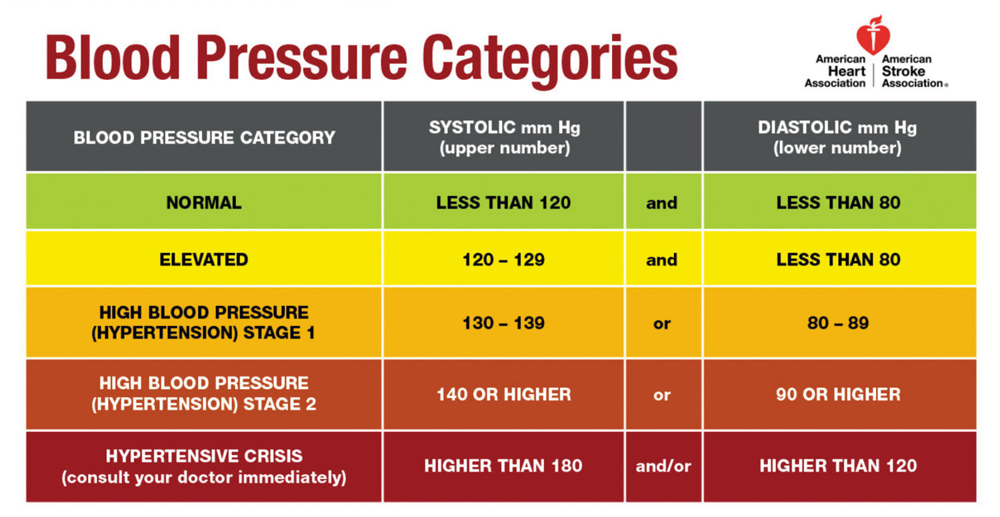
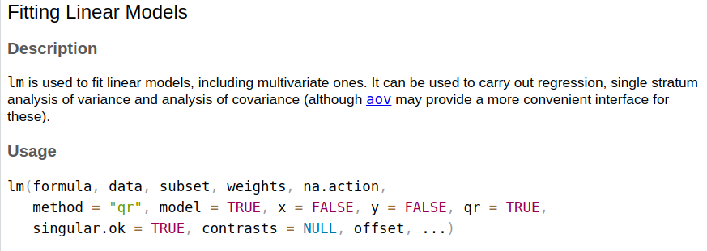
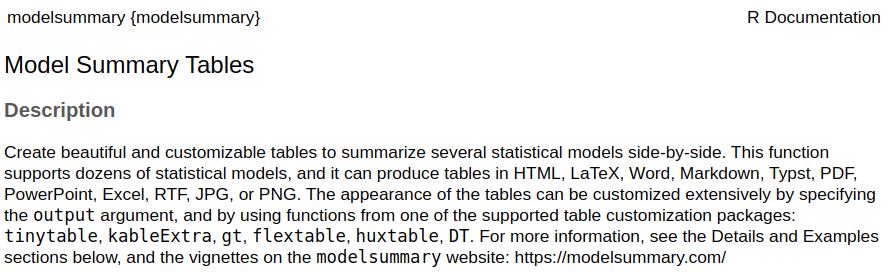
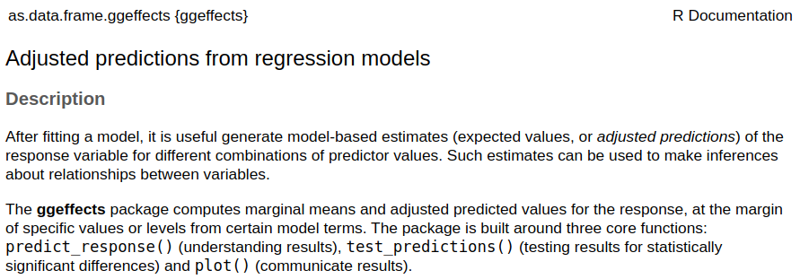

## Today's Agenda {background-image="Images/background-data_blue_v4.png" .center}

```{r}
library(tidyverse)
library(readxl)
library(kableExtra)
library(modelsummary)
library(modelr)
library(ggeffects)
```

<br>

::: {.r-fit-text}

**Ordinary Least Squares (OLS) Regression**

- Using R to fit and evaluate a regression

- New Notes: Regression_Analysis.R

:::

<br>

::: r-stack
Justin Leinaweaver (Spring 2026)
:::

::: notes
Prep for Class

1. Check Canvas submissions

<br>

Today we learn to fit OLS regressions in R

<br>

**SLIDE**: But first, let's use the assignment for today to refresh the basics of simple OLS regressions

:::


## Textbook Exercise 5 {background-image="Images/background-data_blue_v4.png"}

<br>

Do the results of bivariate regression analysis address statistical significance, substantive significance, or both?

::: {.fragment}
{.absolute width="750" bottom=0 left=160}
:::

::: notes

*Get answers from the class*

<br>

Bivariate regression does both!

- Statistical significance, a small p-value, helps us make an argument that our estimated coefficient fits the data better than the null hypothesis

- Substantive significance focuses on the real-world impact of the effect size

<br>

Here's the deal, we are only interested in results that do both

- Statistical significance is almost always an artifact of having a large sample size

- The aim is for a finding that actually helps us understand something significant in the world

<br>

**REVEAL**

- Imagine Pfizer releases a new drug meant to lower blood pressure from the dangerous range down to the normal range

- The good news is that regression testing shows the drug lowers does lower blood pressure and the effect is statistically significant!

- Unfortunately, it only lowers blood pressure by 2 points

- So, a person at 175 gets down to 173

- We know the drug works but not in any way that matters

- **Make sense?**

<br>

As ever, remember that null hypothesis testing helps us make an argument that we have found something useful

- It does NOT settle the question

- **Make sense?**

<br>

**SLIDE**: Exercise 6

:::


## Textbook Exercise 6 {background-image="Images/background-data_blue_v4.png" .center}

<br>

Do gun owners give the Republican Party higher ratings than do people who do not own guns?

$$y = 40.2 + 11.5 (\text{gun owner}) $$

$$ \text{SE of } \beta = 0.76 $$

$$ \text{Adjusted } R^2 = 0.04 $$

::: notes

Part A: “People who do not own guns rated the Republicans at 40.2, on average. However, among gun owners, the Republicans averaged only 11.5 on the scale. Therefore, people who do not own guns are more pro-Republican than are people who own guns.”

- **Is Part A making a correct inference? Why or why not?**

- (Nope!)

- (y = 40.2 + 11.5(1) = 51.7)

<br>

Part B: “The independent variable has a statistically significant effect on the dependent variable.” 

- **Is this inference correct? Why or why not?**

- (Yes)

- t = 11.5 / 0.76 ≈ 15.13

- Big value on the t-distribution will have a small p-value

- Remember the rule of thumb, if estimated coefficient is more than 2 of the SE it is probably significant

<br>

Part C: “The independent variable explains very little of the variation in the dependent variable.”

- **Is this inference correct? Why or why not?**

- (Yes)

- Adjusted R2 = 0.04 indicates that the model explains only 4% of the variation in Republican ratings.

:::


## Textbook Exercise 7 {background-image="Images/background-data_blue_v4.png" .center}

$$ \text{Adjusted-}R^2 = 1 - (1-R^2) (\frac{n-1}{n-k-1}) $$

<br>

```{r}
tibble(
  R2 = c(.348, .489, .631, .355),
  n = c(50, 186, 393, 1527),
  k = c(1, 3, 2, 6),
  AdjR2 = 1 - (1 - R2) * ((n - 1)/(n - k - 1))
) |>
  kable(digits = 3, align = "c") |>
  kable_styling()

```

::: notes

**Did everybody get these results?**

<br>

**Any questions on our material from last class?**

<br>

**SLIDE**: Today we learn to execute OLS in R

:::


## OLS Regression in R {background-image="Images/background-data_blue_v4.png" .center}

::: {.r-fit-text}

1. Fitting a Regression: lm()

2. Making a Regression Table: modelsummary()

3. Making (and Visualizing) Predictions: ggpredict()

<br>

```{r, echo=TRUE, eval=FALSE}
# Install these one time
install.packages("modelsummary")
install.packages("ggeffects")
```

:::

::: notes

Three tools for your proverbial toolbox

- Write these down and install these two add-on packages

:::


## 1. Fitting OLS Regressions in R {background-image="Images/background-data_blue_v4.png"}

<br>

::: {.r-fit-text}
lm(data = dataset, outcome ~ predictor)
:::

{.absolute width="90%" bottom=50 left=65}

::: notes
We use the lm function to fit simple linear models in R

<br>

While the help file shows you can do a ton of stuff with the lm() function, we'll be starting with just these three elements

- Specify the dataset,

- The outcome variable, and

- The predictor

<br>

**SLIDE**: Applied example
:::


## {background-image="Images/background-data_blue_v4.png" .center}

```{r, echo = TRUE}
# Fit the OLS regression (and save the results)
model1 <- lm(data = diamonds, price ~ carat)
```

<br>

```{r, echo = TRUE}
# Summarize the results
summary(model1)
```

::: notes

We don't have to save the output of the lm function as a new object

- HOWEVER, saving your regressions as objects will make it MUCH easier to build tables and make visualizations with your results

<br>

The summary function approach will let you rapidly fit regressions

- *Briefly talk through the components from the table*

- *Find the coefficient, SE, p-value, R2 and Adj R2*

<br>

**Everybody get these results?**

- **Questions on this code?**

<br>

**SLIDE**: Let's polish the table

:::


## 2. Formatting Regression Tables in R {background-image="Images/background-data_blue_v4.png" .center}

<br>



modelsummary(models, ...)

- "models" is the list of regressions you want in the table

::: notes

There are a bunch of packages that can do this, but recently I've been using modelsummary

- Makes a wide variety of elegant tables and the code isn't too tough to tweak

<br>

Using this requires installing the modelsummary package

<br>

**SLIDE**: Basic output

:::


## {background-image="Images/background-data_blue_v4.png" .center .smaller}

:::: {.columns}

::: {.column width="50%"}

<br>

<br>

::::: {.r-fit-text}
```{r, echo=TRUE, eval=FALSE}
library(modelsummary)

modelsummary(model1)
```
:::::

:::

::: {.column width="50%"}
```{r}
library(modelsummary)

modelsummary(model1)
```
:::

::::

::: notes

This is the default output you get if you run the function with no extra arguments

- This is WAY more detail than we actually want but this is because it is much easier to remove lines from this table than it is to add them

<br>

**Did everybody get this code to run?**

<br>

**SLIDE**: Let's polish this table

:::


## 2. Formatting Regression Tables in R {background-image="Images/background-data_blue_v4.png" .center}

<br>

```{r, echo=TRUE, eval=FALSE}
# Polishing a Table - Minumum Required
modelsummary(model1, 
             fmt = 2, 
             stars = c('*' = .05), 
             gof_omit = "AIC|BIC|Log|F")
```

```{r}
modelsummary(model1, output = "gt",
             fmt = 2, stars = c('*' = .05), gof_omit = "IC|Log|F") |>
  gt::tab_style(style = list(
                  gt::cell_fill(color = 'white'),
                  gt::cell_text(size = "large")
  ), locations = gt::cells_body())
```

::: notes

This version modifies three of the arguments in the modelsummary function

- fmt is how many digits after the decimal (two is a good rule of thumb)

- I set the significance stars to one level (.05)

- I omitted a bunch of fit statistics we don't need at the moment

    - Specifically I'm omitting the Akaike information criterion (AIC), Bayesian information criterion (BIC), the log likelihood and the F test


<br>

**Did everybody get this code to run?**

<br>

This is the minimum customization I want you to use

- This ensures the table is readable and focused

<br>

**SLIDE**: However, I want to encourage you to go further in polishing this table

:::


## 2. Formatting Regression Tables in R {background-image="Images/background-data_blue_v4.png" .center}

<br>

```{r, echo=TRUE, eval=FALSE}
# Polishing a Table - The Goal
modelsummary(model1,
             fmt = 2, 
             stars = c('*' = .05), 
             gof_omit = "AIC|BIC|Log|F",
             coef_rename = c("carat" = "Diamond Size (carats)"))
```

```{r}
modelsummary(model1, output = "gt",
             fmt = 2, stars = c('*' = .05), gof_omit = "IC|Log|F",
             coef_rename = c("carat" = "Diamond Size (carats)")) |>
  gt::tab_style(style = list(
                  gt::cell_fill(color = 'white'),
                  gt::cell_text(size = "large")
  ), locations = gt::cells_body())
```

::: notes

Rename the variable labels into plain english

<br>

**Did everybody get this code to run?**

<br>

These extra steps are crucial if the aim is to share your regression table with a professional audience

- This version allows with any regression training to interpret your findings

<br>

**SLIDE**: Finally we can visualize the model results

:::


## 3. Making Predictions in R {background-image="Images/background-data_blue_v4.png" .center}



ggpredict(model, terms)

- "model" is the regression model you've already fit

- "terms" is the predictor you want to focus on

::: notes

This week we've been using algebra and the formula for a line to make predictions using our regression results

- But, of course, R will do it for you!

<br>

Make sure you have the ggeffects package installed and loaded before you can use the ggpredict function

- It can do a TON but we'll focus on just these two parts

- You have to tell ggpredict the name of your regression object and which predictor you want to use to make predictions

<br>

**SLIDE**: Let's use it on the diamonds data

:::


## 3. Making Predictions in R {background-image="Images/background-data_blue_v4.png" .center}

<br>

::::: {.r-fit-text}
```{r, echo=TRUE, eval=FALSE}
library(ggeffects)

ggpredict(model = model1, terms = "carat")
```
:::::

```{r}
library(ggeffects)

ggpredict(model1, terms = "carat")
```

::: notes

Our current regression model only has one predictor so we have only one choice for the ggpredict function

- This code asks for predictions across the main levels of the carat variable in the dataset

<br>

The table shows the predicted value of a diamond at these six possible weights according to our model

- In addition, this table gives us a 95% confidence interval around each prediction

- The CI is meant to convey our level of confidence in the predictions

- Large CIs mean we can't be very certain with this data!

- These CIs are incredibly small because we have 53k observations which is a ton

<br>

**Did everybody get this code to run?**

<br>

**SLIDE**: Visualize these predictions

:::


## 3. Making Predictions in R {background-image="Images/background-data_blue_v4.png" .center}

::::: {.r-fit-text}
```{r, echo=TRUE, eval=FALSE}
plot(ggpredict(model = model1, terms = "carat"))
```
:::::

```{r, eval=TRUE, fig.align='center', fig.retina=3, fig.asp=.8, out.width='70%', fig.width=6}
plot(ggpredict(model = model1, terms = "carat"))
```

::: notes

Just add the plot function around your ggpredict and get a nice visualization

- This will prove VERY helpful when we move to multiple regression in a few weeks

- NOTE: This DOES include the CIs around the line it's just that with 54k diamonds the CI is so tight we can't see it here.

<br>

**Did everybody get this code to run?**

<br>

**SLIDE**: Usefully you can tweak this visualization as if it were a ggplot function

:::


## 3. Making Predictions in R {background-image="Images/background-data_blue_v4.png" .center}

::::: {.r-fit-text}
```{r, echo=TRUE, eval=FALSE}
plot(ggpredict(model = model1, terms = "carat")) +
  scale_y_continuous(labels = scales::dollar_format()) +
  labs(x = "Diamond Size (carats)", y = "")
```
:::::

```{r, eval=TRUE, fig.align='center', fig.retina=3, fig.asp=.8, out.width='70%', fig.width=6}
plot(ggpredict(model = model1, terms = "carat")) +
  scale_y_continuous(labels = scales::dollar_format()) +
  labs(x = "Diamond Size (carats)", y = "")
```

::: notes

Here I'm just making some simple ggplot tweaks

1. Formatting the y-axis in dollars

2. Changing the axis labels

<br>

**Did everybody get this code to run?**

<br>

**SLIDE**: Time to practice!

:::


## {background-image="Images/background-data_blue_v4.png"}

::: {.panel-tabset}

### Practice 1

Data: `mpg` dataset in the tidyverse

<br>

Regress city fuel economy (`cty`) on engine displacement (`displ`) in the `mpg` datatset

- Fit the regression

- Format the table

- Make a predictions plot

### Results

:::: {.columns}
::: {.column width="65%"}
```{r, fig.asp=.85, fig.align='center', fig.width=6}
practice1 <- lm(data = mpg, cty ~ displ)

plot(ggpredict(practice1, terms = "displ")) +
  labs(x = "Engine Size (displacement)",
       y = "Fuel Economy (City)")
```
:::

::: {.column width="35%"}
```{r}
modelsummary(practice1, 
             output = "gt", fmt = 2, 
             stars = c('*' = .05), gof_omit = "IC|Log|F",
             coef_rename = c("displ"= "Engine Size")) |>
  gt::tab_style(style = list(
                  gt::cell_fill(color = 'white'),
                  gt::cell_text(size = "x-large")
  ), locations = gt::cells_body())
```
:::
::::

### Code

```{r, echo=TRUE, eval=FALSE}
# Fit the model
practice1 <- lm(data = mpg, cty ~ displ)

# Polish the table
modelsummary(practice1, 
             fmt = 2, 
             stars = c('*' = .05), 
             gof_omit = "IC|Log|F",
             coef_rename = c("displ"= "Engine Size"))

# Visualize model predictions
plot(ggpredict(practice1, terms = "displ")) +
  labs(x = "Engine Size (displacement)",
       y = "Fuel Economy (City)")
```

:::

::: notes

*Confirm they got the right results*

<br>

*Make the class step you through interpreting the fit of the model*

1. Any missing data problems?

2. Is this a statistically significant result?

3. Is this a substantively significant result? Why or why not?

<br>

**SLIDE**: Let's do this again with another variable in this same dataset

:::


## {background-image="Images/background-data_blue_v4.png"}

::: {.panel-tabset}

### Practice 2

Data: `mpg` dataset in the tidyverse

<br>

Regress highway fuel economy (`hwy`) on engine displacement (`displ`) in the `mpg` datatset

- Fit the regression

- Format the table

- Make a predictions plot

### Results

:::: {.columns}
::: {.column width="65%"}
```{r, fig.asp=.85, fig.align='center', fig.width=6}
practice2 <- lm(data = mpg, hwy ~ displ)

plot(ggpredict(practice2, terms = "displ")) +
  labs(x = "Engine Size (displacement)",
       y = "Fuel Economy (Highway)")
```
:::

::: {.column width="35%"}
```{r}
modelsummary(models = list(practice1, practice2), 
             output = "gt", fmt = 2, 
             stars = c('*' = .05), gof_omit = "IC|Log|F",
             coef_rename = c("displ"= "Engine Size")) |>
  gt::tab_style(style = list(
                  gt::cell_fill(color = 'white'),
                  gt::cell_text(size = "x-large")
  ), locations = gt::cells_body())
```
:::
::::

### Code

```{r, echo=TRUE, eval=FALSE}
# Fit the model
practice2 <- lm(data = mpg, hwy ~ displ)

# Polish the table
modelsummary(models = list(practice1, practice2), 
             fmt = 2, 
             stars = c('*' = .05), 
             gof_omit = "IC|Log|F",
             coef_rename = c("displ"= "Engine Size"))

# Visualize model predictions
plot(ggpredict(practice2, terms = "displ")) +
  labs(x = "Engine Size (displacement)",
       y = "Fuel Economy (Highway)")
```

:::

::: notes

*Confirm they got the right results*

<br>

Note: Here I am showing you the code to put TWO models in ONE table using modelsummary

- THIS is an important bit of code you want to save for the future!

- Same argument as before ("models") but now you give it a list of YOUR models

- You can do this with as many regression models as you want

<br>

*Make the class step you through comparing the fit of the two models*

1. Any missing data problems?

2. Is this a statistically significant result?

3. Is this a substantively significant result? Why or why not?

<br>

**SLIDE**: Let's try some new data

:::


## {background-image="Images/background-data_blue_v4.png"}

::: {.panel-tabset}

### Practice 3

Data: Incumbent_Performance_US_Elections.xlsx

<br>

Regress presidential vote share (`vote_share`) on presidential approval rating (`approval_june`) using the datatset on Canvas

- Fit the regression

- Format the table

- Make a predictions plot

```{r}
d <- read_excel("../../DATA/2026-Spring/Incumbent_Performance_US_Elections.xlsx", na = "NA")
```

### Results

:::: {.columns}
::: {.column width="65%"}
```{r, fig.asp=.85, fig.align='center', fig.width=6}
practice3 <- lm(data = d, vote_share ~ approval_june)

plot(ggpredict(practice3, terms = "approval_june")) +
  labs(x = "Presidential Approval in June (%)",
       y = "Presidential Vote Share (%)")
```
:::

::: {.column width="35%"}
```{r}
modelsummary(practice3, 
             output = "gt", fmt = 2, 
             stars = c('*' = .05), gof_omit = "IC|Log|F",
             coef_rename = c("approval_june"= "Approval in June (%)")) |>
  gt::tab_style(style = list(
                  gt::cell_fill(color = 'white'),
                  gt::cell_text(size = "x-large")
  ), locations = gt::cells_body())
```
:::
::::

### Code

```{r, echo=TRUE, eval=FALSE}
# Fit the model
practice3 <- lm(data = d, vote_share ~ approval_june)

# Polish the table
modelsummary(practice3, 
             fmt = 2, 
             stars = c('*' = .05), 
             gof_omit = "IC|Log|F",
             coef_rename = c("approval_june"= "Approval in June (%)"))

# Visualize model predictions
plot(ggpredict(practice3, terms = "approval_june")) +
  labs(x = "Presidential Approval in June (%)",
       y = "Presidential Vote Share (%)")
```

:::

::: notes

*Confirm they got the right results*

<br>

*Make the class step you through interpreting the fit of the model*

:::


## For Next Class {background-image="Images/background-data_blue_v4.png" .center}

<br>

**What explains the variation in global life expectancy?**

1. Secondary education?

2. Measles immunity?

3. The fertility rate?

::: notes

Canvas assignment for next class will let us practice all these skills!

- In short, I am asking you to fit and evaluate three models that each aim to answer this question

- For the assignment you will submit your findings and evaluate each model

<br>

**Questions on the assignment?**

<br>

Canvas Assignment: Practice fitting and interpreting bivariate OLS regressions

Data: World_Development_Indicators-2023-Life_Expectancy.xlsx

What explains the variation in global life expectancy? Fit three bivariate OLS regressions to separately test different models based on: 1) the proportion of the population with a secondary education (`secondary_education_pct`), 2) the proportion of the population with measles immunity (`measles_immune_pct`), and 3) the fertility rate per woman (`fertility_rate_per_woman`). 

1. Submit a polished table for each model (or one table with all three models)
2. Evaluate the fit of each model using the criteria we discussed in class (e.g. missing data, significance and R2): Is each model a good fit of the data or not?
3. Evaluate the substantive significance of each model: How large, in real-world terms, is the effect of each mechanism on life expectancy? Is this a useful mechanism for countries trying to improve life expectancy or not?
4. Based on your work above, make an argument for which model is the most useful for explaining the variation in global life expectancy?

:::


