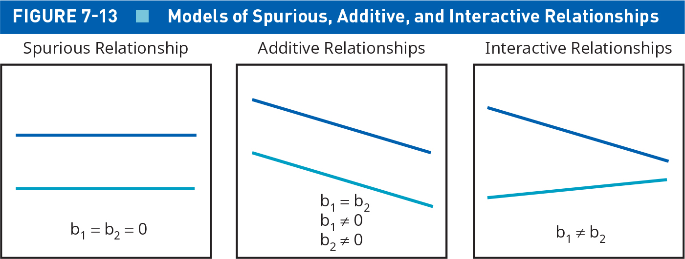
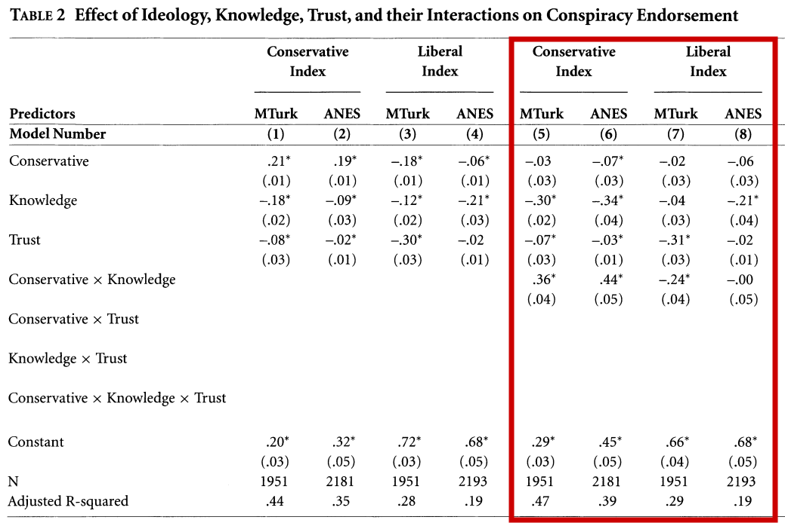
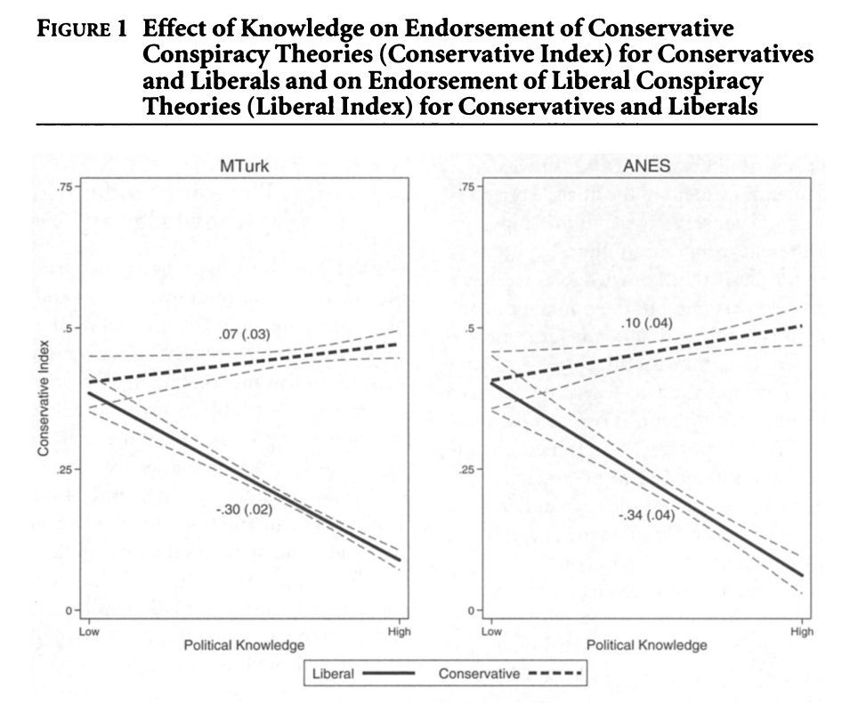
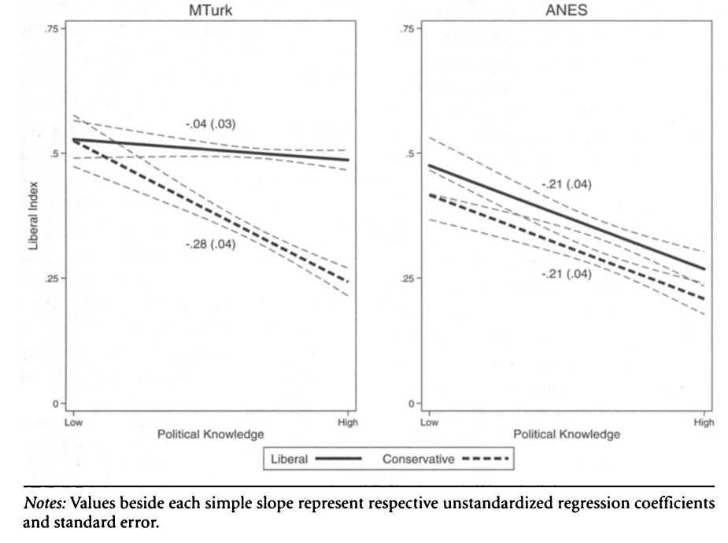

## Today's Agenda {background-image="Images/background-data_blue_v4.png" .center}

```{r}
library(tidyverse)
library(readxl)
library(kableExtra)
library(modelsummary)
#library(modelr)
library(ggeffects)

# Load US States Data
d <- read_excel("../../DATA/2026-Spring/Pollock_Edwards_Textbook/Pollock_Edwards-US_States.xlsx", na = "NA")

d$voter_id <- if_else(d$voter.id.law != "No document required", 1, 0) |>
  as_factor()

# Load ANES data
# load("../../DATA/2026-Spring/ANES/ANES2020_Data_Extract.RData")
# 
# # YOU create the knowledge index and upload new version of ANES
# anes$political_knowledge <- 
#   ifelse(anes$polquiz.fedspend == "1. Foreign aid (correct)", 1, 0) + 
#   ifelse(anes$polquiz.german == "1. Correct", 1, 0) +
#   ifelse(anes$polquiz.housemaj == "1. Democrats (correct)", 1, 0) +
#   ifelse(anes$polquiz.russian == "1. Correct", 1, 0) +
#   ifelse(anes$polquiz.scotus == "2. Correct", 1, 0) +
#   ifelse(anes$polquiz.sen.term == "6", 1, 0) +
#   ifelse(anes$polquiz.senatemaj == "2. Republicans (correct)", 1, 0) +
#   ifelse(anes$polquiz.speaker == "1. Correct", 1, 0) +
#   ifelse(anes$polquiz.vp == "1. Correct", 1, 0)
# 
# # Output the new ANES data for Canvas
# save(anes, file = "../../DATA/2026-Spring/ANES/ANES2020_Data_Extract-WEEK13.RData")

load("../../DATA/2026-Spring/ANES/ANES2020_Data_Extract-WEEK13.RData")
```

<br>

::: {.r-fit-text}

**Ordinary Least Squares (OLS) Regression**

- Extending an OLS regression with interaction effects

:::

<br>

::: r-stack
Justin Leinaweaver (Spring 2026)
:::

::: notes
Prep for Class

1. Check Canvas submissions

<br>

**SLIDE**: Let's kick things off with your assignment for today

:::


## {background-image="Images/background-data_blue_v4.png" .center}

::: {.r-fit-text}
**RQ: Do voter ID laws reduce voter turnout?**
:::

:::: {.columns}

::: {.column width="35%"}

<br>

<br>

```{r, fig.align='center', fig.width=6}
## Manual DAG
d1 <- tibble(
  x = c(1, 2, 3),
  y = c(1, 2, 1),
  labels = c("Voter ID", "Confounders", "Voter\nTurnout")
)

ggplot(data = d1, aes(x = x, y = y)) +
  geom_point(size = 0, color = "white") +
  theme_void() +
  coord_cartesian(xlim = c(0, 4), ylim = c(.75, 2.25)) +
  geom_label(aes(label = labels), size = 5) +
  annotate("segment", x = 1.5, xend = 2.5, y = 1, yend = 1, arrow = arrow()) +
  annotate("segment", x = 1.7, xend = 1, y = 1.85, yend = 1.15, arrow = arrow()) +
  annotate("segment", x = 2.3, xend = 3, y = 1.85, yend = 1.15, arrow = arrow())
```
:::

::: {.column width="65%"}
**Possible Confounders**

- Ethnicity: hispanic.percent, black.percent, white.percent
- Education: hs.or.more, ba.or.more, adv.or.more
- Elite pressure: trump2016
- Ideology: public.conservative
- Wealth: hh.income
- Electoral stakes: battleground2020
:::

::::

::: notes

For today I asked you to build a causal argument that would allow us to measure the effect of voter ID laws on voter turnout

- **How did that go?**

<br>

**Which confounders did you decide were important in this causal mechanism? Why**

- *Get examples and arguments from various people!*

<br>

**SLIDE**: Here's one possible version

:::


## {background-image="Images/background-data_blue_v4.png" .center .smaller}

::: {.r-fit-text}
**RQ: Do voter ID laws reduce voter turnout?**
:::

```{r}
# (Factors that predict swing states AND pressure for voter ID
# - Ethnicity: hispanic.percent, black.percent, white.percent
# - Inequality: gini.2016
# - Education: ba.or.more
# - Elite pressure: trump2016
# - Ideology: public.conservative
# - Wealth: hh.income
# - Electoral stakes: battleground2020
d$trump2016_100 <- d$trump2016*100

res1 <- lm(data = d, vep20.turnout ~ voter_id)
res2 <- lm(data = d, vep20.turnout ~ voter_id + battleground2020)
res3 <- lm(data = d, vep20.turnout ~ voter_id + trump2016_100)
res4 <- lm(data = d, vep20.turnout ~ voter_id + hispanic.percent + black.percent)
res5 <- lm(data = d, vep20.turnout ~ voter_id + battleground2020 + trump2016_100 +  hispanic.percent + black.percent)

modelsummary(models = list(res1, res2, res3, res4, res5),
             fmt = 2,
             stars = c("*" = .05),
             out = "gt",
             gof_omit = "IC|F|Log", 
             coef_map = c("voter_id1" = "Voter ID", "battleground2020" = "Battleground State", "trump2016_100" = "Trump Vote (%, 2016)", "hispanic.percent" = "Hispanic (%)", "black.percent" = "Black (%)", "(Intercept)" = "Constant")) |>
  gt::tab_style(style = list(
                  gt::cell_fill(color = 'white'),
                  gt::cell_text(size = "large")
  ), locations = gt::cells_body())

# # Is there a difference by ethnicity and voter id?
# aggregate(data = d, hispanic.percent ~ voter_id, mean)
# t.test(data = d, hispanic.percent ~ voter_id)
# aggregate(data = d, black.percent ~ voter_id, mean)
# t.test(data = d, black.percent ~ voter_id)

# ## Check student regressions from the homework
# res_a <- lm(data = d, vep20.turnout ~ voter_id + trump2016 + hh.income)
# modelsummary(models = res_a, fmt = 2, stars = c("*" = .05))
# 
# 
# 
# Please redo with one model that includes all your selected confounders.
# 
# Do not report a coefficient of 0.00. Rescale the variable and refit the model.
```

::: notes

In my Model 5 I decided to focus on three types of confounder

1. Heightened stakes of the election
    
    - Living in a battleground state increases the likelihood your vote will be decisive so increases the probability of turnout
    - Anticipating a close fought battle should put pressure on legislatures to consider rules to manipulate the election

2. Elite Signaling

    - Trump's go-to argument has been that electoral fraud is rampant and must be addressed. If your state voted hard for Trump, then per the research, there is likely support for voter ID. 
    - Different level of enthusiasm for prior voters than others

3. Ethnicity

    - I think it would be naive to claim that at least some of the push for voter ID hasn't been targeted at non-white populations. 
    - It is also well supported in the lit that different ethnic groups vote at different rates.

<br>

IMPORTANT NOTES: 

1. Data Cleaning Problem

    - In the dataset, both Trump vote and the ethnicity variables are %s

    - BUT, Trump vote is measured from 0-1 and ethnicity from 0-100

    - SO, I converted the Trump vote to the 0-100 scale
    
2. Always show the steps in your model building!

    - My causal argument is Model 5 so that's the one I am arguing the reader should interpret and focus on, HOWEVER
    
    - Be transparent in your choices!
    
    - Help the reader see how each control might impact the final regression

<br>

**Ok, interpret the partial coefficients in Model 5 for me**

- **How does each predictor increase or decrease voter turnout?**

<br>

**Now let's evaluate Model 5 in terms of statistical significance**

1. Missing data?

2. Significance?

3. R2?

<br>

**Are we confident saying Model 5 fits the data well?**

<br>

**SLIDE**: And now let's talk substantive significance

:::


## {background-image="Images/background-data_blue_v4.png" .center .smaller}

::: {.r-fit-text}
**RQ: Do voter ID laws reduce voter turnout?**
:::

:::: {.columns}

::: {.column width="50%"}
```{r}
modelsummary(models = list(res5),
             fmt = 2,
             stars = c("*" = .05),
             out = "gt",
             gof_omit = "IC|F|Log", 
             coef_map = c("voter_id1" = "Voter ID", "battleground2020" = "Battleground State", "trump2016_100" = "Trump Vote (%, 2016)", "hispanic.percent" = "Hispanic (%)", "black.percent" = "Black (%)", "(Intercept)" = "Constant")) |>
  gt::tab_style(style = list(
                  gt::cell_fill(color = 'white'),
                  gt::cell_text(size = "medium")
  ), locations = gt::cells_body())
```
:::

::: {.column width="50%"}
```{r, echo=TRUE, eval=FALSE}
# Visualize the causal mechanism
# (basic code only)
plot(ggpredict(res5, terms = "voter_id"))
```

```{r, echo=FALSE, fig.align='center', fig.asp=.9, fig.width=5}
# Visualize the causal mechanism
plot(ggpredict(res5, terms = "voter_id")) +
  labs(x = "", y = "Voter Turnout (VEP 2020)") +
  scale_x_continuous(breaks = 0:1, labels = c("No Voter ID", "Voter ID"))
```
:::

::::

::: notes

Here is the predictions plot for the CAUSAL effect of voter ID on voter turnout using my Model 5

<br>

**Make it clear for me, how can I claim this is the causal effect?**

- (This is the estimate from Model 5 which controls for all the relevant confounders)

- (Multiple regression produces partial regression coefficients!)

<br>

**Bottom line, what do we learn from these models?**

- **Do states with voter ID laws see lower turnout in elections or not?**

<br>

I do just want to caution you about the inference here

1. I did not build this dataset and am not clear on the measurements and sources of some of these variables

    - This is ESPECIALLY true of the voter ID variable
    
    - This requires a much more careful measure of the main predictor

2. The effect of voter ID on the decision to vote strikes me as an individual level mechanism as much as a group level one

    - I'd like to see this supplemented with individual level data

<br>

SO, I wouldn't walk away from this analysis thinking we've definitively demonstrated anything

- On the other hand, this does seem strongly suggestive that voter ID laws were less burdonsome in 2020 than might be feared

<br>

**Questions on this work for today?**

<br>

**SLIDE**: Today we add our next extension to our regressions

:::


## {background-image="Images/background-data_blue_v4.png" .center}

::: {.r-fit-text}
**Adapting a Regression to Different Relationships**
:::

<br>

{style="display: block; margin: 0 auto"}

::: notes

Back in our work making controlled comparisons I asked you to practice identifying types of relationships

- **Which of these three boxes are covered by our current OLS regressions?**

- (Box 1: If your main multiple OLS coefficient is not significant then you've found that adding a confounder suggests a spurious relationship)

- (Box 2: If your main multiple OLS coefficient is significant after controlling for confounders then you've found evidence for an additive relationship)

<br>

Our current methods have not allowed us to model interactive relationships in OLS (box 3)

- But here's the deal, you should ALWAYS check for interactions in the main effects of your models. 

- Anything that affects people will likely affect different people in different ways

<br>

**SLIDE**: Ok, let's introduce interaction effects by answering a research question with data!

:::


## {background-image="Images/background-data_blue_v4.png" .center}

::: {.r-fit-text}
**RQ: What explains the variation in how Americans feel about journalists?**
:::

- H1: The more knowledgable individuals are about the world, the more they will value journalists

- H2: The political parties have VERY different relationships to the media

<br>

::: {.fragment}

1. Load the ANES2020_Data_Extract-WEEK13.RData

2. Perform univariate analyses on the three variables: `ft.journalists`, `political_knowledge`, `partyid3`

:::

::: notes

Let's explore this RQ and these two hypotheses

- *Read slide*

<br>

**REVEAL**: First steps!

- (**SLIDE**: Results)

:::


## {background-image="Images/background-data_blue_v4.png" .center .smaller}

::: {.r-fit-text}
**RQ: What explains the variation in how Americans feel about journalists?**
:::

```{r, fig.align='center', fig.asp=.618, out.width="45%", fig.width=6}
anes |>
  ggplot(aes(x = ft.journalists)) +
  geom_histogram(bins = 10, color = "white") +
  theme_bw()
```

:::: {.columns}
::: {.column width="50%"}
```{r, fig.width=6, fig.asp=.618}
anes |>
  ggplot(aes(x = political_knowledge)) +
  geom_bar() +
  theme_bw() +
  scale_x_continuous(breaks = 0:9)
```
:::

::: {.column width="50%"}
```{r, fig.width=6, fig.asp=.618}
anes |>
  select(partyid3) |>
  na.omit() |>
  ggplot(aes(x = partyid3)) +
  geom_bar() +
  theme_bw()
```
:::
::::

::: notes

**Ok, what do we learn from our univariate analyses?**

<br>

**Do we have good variation to explain in the outcome?**

- **Is the average a good summary of the outcome variable? Why or why not?**

<br>

**Do we have good variation in our predictors?**

- **Anybody else surprised that the independent bar is as tall as the party bars?**

<br>

Apparently the ANES team is folding some leaners into the middle which is not how this is usually done

- Compared to most research I think this coding choice over-estimates independents

- BUT, it does mean the party bars are clear partisans which helps too

<br>

**SLIDE**: Ok, let's test each hypothesis using NON-OLS tools

:::


## {background-image="Images/background-data_blue_v4.png" .center}

::: {.r-fit-text}
**RQ: What explains the variation in how Americans feel about journalists?**
:::

- H1: The more knowledgable individuals are about the world (`political_knowledge`), the more they will value journalists (`ft.journalists`)

- H2: The political parties (`partyid3`) have VERY different relationships to the media (`ft.journalists`)

<br>

::: {.incremental}

- H1: Interval x Interval -> Correlation and scatter plot

- H2: Interval x Nominal -> Difference of means and ANOVA

:::

::: notes

**For H1, how do we analyze the relationship between two interval variables?**

- (**REVEAL**: correlation and scatter plot)

<br>

**For H2, how do we examine the relationship between an interval variable and a categorical variable?**

- (**REVEAL**: Difference of means and ANOVA)
    
<br>

Ok, do both of those!

- (**SLIDE**)

:::


## {background-image="Images/background-data_blue_v4.png" .center}

```{r, echo=TRUE}
# H1: The more individuals are checked into the world, 
#         the more they value journalists
cor(anes$ft.journalists, anes$political_knowledge, use = "pairwise")
```

```{r, echo=TRUE, fig.align='center', out.width="55%", fig.asp=.85, fig.width=6}
ggplot(anes, aes(x = political_knowledge, y = ft.journalists)) +
  geom_jitter(alpha = .1) +
  theme_bw() +
  labs(x = "Political Knowledge (0-9)")
```

::: notes

Here I've added two extra arguments to help us see through all the overlapping points

- geom_jitter argument moves the dots around a tiny amount so they don't overlap as much

- The alpha argument makes each point a lighter color so it takes a bunch of overlap to make the dot darker

<br>

**What do we take from this first pass?**

- **Do these results suggest a relationship between political knowledge and approval of journalists? Why or why not?**

<br>

**SLIDE**: What about the relationship between party and approval of journalists?

:::


## {background-image="Images/background-data_blue_v4.png" .center}

### H2: The political parties have VERY different relationships to the media

```{r, echo=TRUE}
aggregate(data = anes, ft.journalists ~ partyid3, mean)
```

<br>

```{r, echo=TRUE}
aov(data = anes, ft.journalists ~ partyid3) |> summary()
```

::: notes

**What do we take from this first pass?**

- **Do these results suggest a relationship?**

<br>

Hot damn that's a big difference!

- And, of course with difference this big, we can reject the NULL

<br>

**SLIDE**: OLS time

:::


## {background-image="Images/background-data_blue_v4.png" .center}

::: {.r-fit-text}
**RQ: What explains the variation in how Americans feel about journalists?**
:::

<br>

1. Create TWO dummy variables using `partyid3`

    - anes$Democrat = 1 if "1. Democrat", 0 otherwise
    - anes$Independent = 1 if "2. Independent", 0 otherwise

2. Fit and evaluate TWO OLS models

    - Model 1: Regress ft.journalists on political_knowledge
    - Model 2: Regress ft.journalists on Democrat and Independent
    
::: notes

Ok, let's build some dummy variables and then fit two regressions

<br>

**Remind me, why am I not asking you to create a Republican dummy and to include it in Model 2?**

- (Per the book, when converting a categorical variable into dummies you MUST leave one out)

- The omitted level becomes the baseline of comparison and is captured by the intercept term

<br>

Go!

:::


## {background-image="Images/background-data_blue_v4.png" .center}

::: {.r-fit-text}
**RQ: What explains the variation in how Americans feel about journalists?**
:::

- H1: The more knowledgable individuals are about the world, the more they will value journalists

:::: {.columns}
::: {.column width="50%"}

```{r}
anes$Democrat <- if_else(anes$partyid3 == "1. Democrat", 1, 0) |> as_factor()
anes$Republican <- if_else(anes$partyid3 == "3. Republican", 1, 0) |> as_factor()
anes$Independent <- if_else(anes$partyid3 == "2. Independent", 1, 0) |> as_factor()

model1 <- lm(data = anes, ft.journalists ~ political_knowledge)
model2 <- lm(data = anes, ft.journalists ~ Democrat + Independent)
#model2 <- lm(data = anes, ft.journalists ~ Democrat + Republican)

modelsummary(models = list(model1),
             fmt = 2,
             stars = c("*" = .05),
             out = "gt",
             gof_omit = "IC|F|Log", 
             coef_map = c("political_knowledge" = "Political Knowledge (0-9)", "Democrat1" = "Democrat", "Republican1" = "Republican", "Independent1"="Independent", "(Intercept)" = "Constant")) |>
  gt::tab_style(style = list(
                  gt::cell_fill(color = 'white'),
                  gt::cell_text(size = "x-large")
  ), locations = gt::cells_body())
```

:::

::: {.column width="50%"}
```{r, fig.asp=0.85, fig.width=6}
plot(ggpredict(model1, terms = "political_knowledge")) +
  scale_x_continuous(breaks = 0:9) +
  ylim(0,100)
```
:::
::::

::: notes

**Did everybody get these results for Model 1?**

<br>

**So, is Model 1 statistically significant? Why or why not?**

- Missing data: 7079 / `r nrow(anes)` = 1 - .85 = 15%
- R2 is cartoonishly small

<br>

**And per this prediction plot, is Model 1 substantively significant? Why or why not?**

- Effect is remarkably small
- Go all the way from 0 knowledge to total knowledge and gain only 11 points on a 100 point scale

<br>

**SLIDE**: Model 2

:::


## {background-image="Images/background-data_blue_v4.png" .center}

::: {.r-fit-text}
**RQ: What explains the variation in how Americans feel about journalists?**
:::

- H2: The political parties have VERY different relationships to the media

```{r}
modelsummary(models = list(model2),
             fmt = 2,
             stars = c("*" = .05),
             out = "gt",
             gof_omit = "IC|F|Log", 
             coef_map = c("political_knowledge" = "Political Knowledge (0-9)", "Democrat1" = "Democrat", "Republican1" = "Republican", "Independent1"="Independent", "(Intercept)" = "Constant")) |>
  gt::tab_style(style = list(
                  gt::cell_fill(color = 'white'),
                  gt::cell_text(size = "x-large")
  ), locations = gt::cells_body())
```

::: notes

**Shift to Model 2 and tell me, is it statistically significant? Why or why not?**

- Less missing data: 7347 / `r nrow(anes)` = 1 - .89 = 11%
- MUCH higher R2

<br>

**Ok, so clarify it for me, since we left the Republican dummy out of the model, how do I interpret the substantive significance of Model 2?**

- **What is the predicted effect of being a Republican on approval of journalists?**

- (The intercept!)

<br>

**And what is the predicted effect of being a Democrat on approval of journalists?**

- (The intercept PLUS the coefficient on Democrats!)

<br>

**SLIDE**: Let's see it!

:::


## {background-image="Images/background-data_blue_v4.png" .center}

::: {.r-fit-text}
**RQ: What explains the variation in how Americans feel about journalists?**
:::

- H2: The political parties have VERY different relationships to the media

:::: {.columns}
::: {.column width="40%"}

```{r}
modelsummary(models = list(model2),
             fmt = 2,
             stars = c("*" = .05),
             out = "gt",
             gof_omit = "IC|F|Log", 
             coef_map = c("political_knowledge" = "Political Knowledge (0-9)", "Democrat1" = "Democrat", "Republican1" = "Republican", "Independent1"="Independent", "(Intercept)" = "Constant")) |>
  gt::tab_style(style = list(
                  gt::cell_fill(color = 'white'),
                  gt::cell_text(size = "large")
  ), locations = gt::cells_body())
```

:::

::: {.column width="60%"}
```{r, echo=FALSE, fig.asp=0.85, fig.align='center', fig.width=5, out.width="85%"}
plot(ggpredict(model2, terms = "Democrat")) +
  labs(x = "", title = "Predicted values of Model 2") +
  scale_x_continuous(breaks = c(0, 1), 
                     labels = c("Republicans", "Democrats"))
```

:::
::::

::: notes

That is a MASSIVE substantive difference!!

<br>

Now we want to examine if these two sets of variables represent an additive or interactive relationship

- In other words, I'd like to see the effect of political knowledge on approval of journalists but for each party separately

- e.g. one time for just the Democrats and one time for just the Republicans

<br>

**How do I do that using our controlled comparison tools?**

- (1. Split the sample into Dems vs Republicans)
- (2. Check the correlation for each subset)

<br>

Ok, everybody do that!

:::


## {background-image="Images/background-data_blue_v4.png" .smaller}

::: {.panel-tabset}

### Republicans

```{r, echo=TRUE, fig.align='center', fig.asp=.75, out.width="45%"}
# Make the subset
anes_r <- subset(anes, Republican == 1)

# Correlation
cor(anes_r$political_knowledge, anes_r$ft.journalists, use = "pairwise")
```

```{r, echo=FALSE, fig.align='center', fig.asp=.75, out.width="55%", fig.width=6}
# Visualize
ggplot(anes_r, aes(x = political_knowledge, y = ft.journalists)) +
  geom_jitter(alpha = .1) +
  theme_bw() +
  labs(x = "Political Knowledge (0-9)")
```

### Democrats

```{r, echo=TRUE, fig.align='center', fig.asp=.75, out.width="45%"}
# Make the subset
anes_d <- subset(anes, Democrat == 1)

# Correlation
cor(anes_d$political_knowledge, anes_d$ft.journalists, use = "pairwise")
```

```{r, echo=FALSE, fig.align='center', fig.asp=.75, out.width="55%", fig.width=6}
# Visualize
ggplot(anes_d, aes(x = political_knowledge, y = ft.journalists)) +
  geom_jitter(alpha = .1) +
  theme_bw() +
  labs(x = "Political Knowledge (0-9)")
```
:::

::: notes

There is DEFINITELY something going on here

- The correlations are reversed by party, AND

- The bulk of the data points are in opposite corners!

<br>

**SLIDE**: This does not look like an additive relationship, but we have to check!

:::


## {background-image="Images/background-data_blue_v4.png" .center}

::: {.r-fit-text}
**RQ: What explains the variation in how Americans feel about journalists?**
:::

```{r, echo=TRUE}
model3 <- lm(data = anes, ft.journalists ~ 
               political_knowledge * Democrat + Independent)
```

```{r}
modelsummary(models = list(model1, model2, model3),
             fmt = 2,
             stars = c("*" = .05),
             out = "gt",
             gof_omit = "IC|F|Log", 
             coef_map = c("political_knowledge" = "Political Knowledge (0-9)", "Democrat1" = "Democrat", "political_knowledge:Democrat1" = "Knowledge x Democrat", "Republican1" = "Republican", "Independent1"="Independent", "(Intercept)" = "Constant")) |>
  gt::tab_style(style = list(
                  gt::cell_fill(color = 'white'),
                  gt::cell_text(size = "large")
  ), locations = gt::cells_body())
```

::: notes

We use the asterisk to represent an interaction between political knowledge and Democrats

- R will atuomatically include both terms separately AND the interaction between them

<br>

Walk me through evaluating the fit of Model 3

- Missing data?

- Significant coefficients?

- R2?

<br>

Ok, everyone convert Model 3 to the formula for a line so you can use it to make predictions

<br>

First focus just on the Republicans

- **What is the predicted approval of journalists for a Republican with a zero on the political knowledge index?**

    - (33.34)
    
- **And what about a Republican with a 9 on the political knowledge index?**

    - (33.34 - .58 x 9 = 33.34 - 5.22 = 28.12)

<br>

So, per Model 3 Republican approval of journalists moves from a 33 DOWN to a 28 as political knowledge increases.

<br>

Now shift to the Democrats.

- **What is the prediction for Democrats with a zero political knowledge vs with a nine in political knowledge?**

    - *If needed do it on the board*

    - (0 knowledge: 33.34 + 20.48 = 53.82)
    
    - (9 knowledge: 33.34 + 20.48 + 3.45*9 - .58*9 = 79.65)

<br>

**SLIDE**: Let's use ggplot to check!

:::


## {background-image="Images/background-data_blue_v4.png" .center}

::: {.r-fit-text}
**RQ: What explains the variation in how Americans feel about journalists?**
:::

```{r, echo=TRUE, fig.asp=0.85, fig.align='center', out.width="75%", fig.width=6}
plot(ggpredict(model3, terms = c("political_knowledge", "Democrat"))) +
  labs(x = "Political Knowledge (0-9)") +
  scale_x_continuous(breaks = 0:9)
```

::: notes

We did it!

<br>

**So, what did we find in this case? How does political knowledge interact with party to explain approval of journalists?**

- (Dems approval of journalists explodes with knowledge)

- (Reps approval of journalists falls slightly with increases in knowledge)

<br>

**Any guesses why this might be?**

<br>

**Ok, how are we doing with implementing and interpreting an interaction in an OLS regression?**

<br>

**SLIDE**: Let's take a look at an example from the literature

:::


## {background-image="Images/background-data_blue_v4.png" .center}

{style="display: block; margin: 0 auto"}

::: notes

The second set of models in the Miller, Saunders and Farhart (2016) article examine conspiracy theory belief using an interaction!

<br>

**What do we see in this interaction?**

- **How does ideology interact with political knowledge for explaining belief in conspiracy theories?**

<br>

**SLIDE**: Here's the effect visualized by the researchers

:::


## {background-image="Images/background-data_blue_v4.png" .center}

{style="display: block; margin: 0 auto"}

::: notes

Here we see the visualizations of the effects from Models 5 and 6 which focus on the conservative conspiracy theories only

<br>

**Describe the interaction effect for me**

- (As political knowledge increases, fewer liberals believe in conservative CTs)

- (The effect is the opposite for conservatives but much weaker)

<br>

**SLIDE**: The liberal CTs

:::


## {background-image="Images/background-data_blue_v4.png" .center}

{style="display: block; margin: 0 auto"}

::: notes

**Describe the interaction effect for me**

- (Opposite from previous: As political knowledge increases, fewer conservatives believe in liberal CTs)

- (Liberal respondents seem to reduce their belief with knowledge increases but the effects are inconsistent across the surveys)

<br>

**Questions on the interactions?**

<br>

**SLIDE**: For next class

:::


## For Next Class {background-image="Images/background-data_blue_v4.png" .center}

<br>

1. Read Chapter 13 on residuals

2. Complete Exercises 3 and 4

3. Practice fitting OLS regressions with OLS to answer this question

    - Does a free press reduce global economic inequality?
    
::: notes

Three jobs for Monday

- *Read slide*

<br>

**SLIDE**: The practice exercise

:::


## {background-image="Images/background-data_blue_v4.png" .center}

::: {.r-fit-text}
**RQ: Does a free press reduce global economic inequality?**
:::

- Model 1: Regress economic inequality (gini.index) on the press freedom score (press.freedom.fh)

- Model 2: Regress economic inequality on whether the judiciary is independent (indep.judiciary)*

- Model 3: Regress economic inequality on the interaction between press freedom and a free judiciary

::: notes

A couple crucial notes here

1. The Gini index runs from 0 to 1

    - The higher the score the worse (e.g. the more unequal the society)

2. The Press Freedom Index runs from 0 to 10

    - The higher the better

3. You'll have to convert the judiciary variable into a numerical dummy

<br>

**Questions?**

- Details on Canvas

:::

