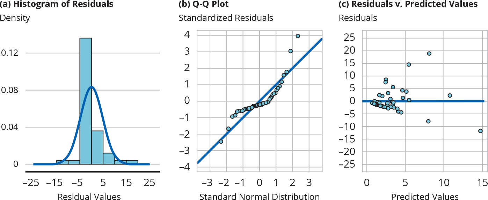
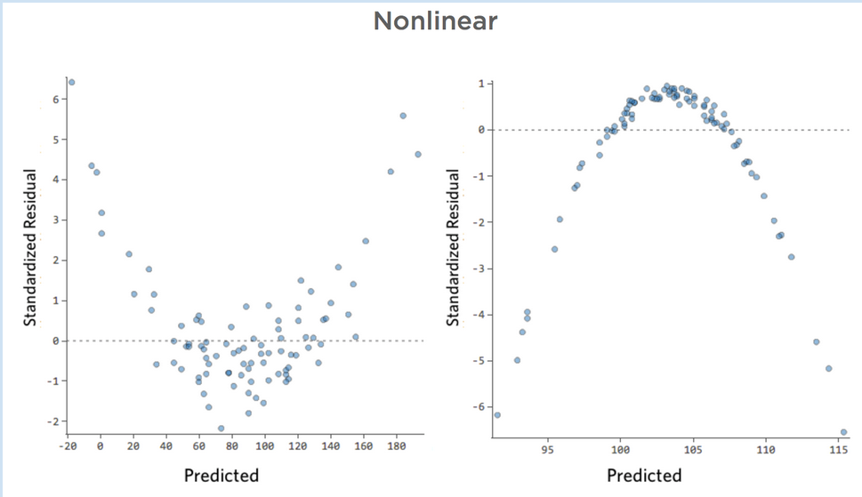

## Today's Agenda {background-image="Images/background-data_blue_v4.png" .center}

```{r}
library(tidyverse)
library(readxl)
library(kableExtra)
library(modelsummary)
library(modelr)
library(ggeffects)

# Canvas homework
d <- read_excel("../../DATA/2026-Spring/Pollock_Edwards_Textbook/Pollock_Edwards-World.xlsx", na = "NA")
```

<br>

::: {.r-fit-text}

**Ordinary Least Squares (OLS) Regression**

- Analyzing regression residuals

- Notes: Regression_Analysis.R

:::

<br>

::: r-stack
Justin Leinaweaver (Spring 2026)
:::

::: notes
Prep for Class

1. Check Canvas submissions

<br>

**SLIDE**: Let's kick things off with your assignment for today

:::


## {background-image="Images/background-data_blue_v4.png" .center}

::: {.r-fit-text}
**RQ: Does a free press reduce global economic inequality?**
:::

::::: {.fragment}

:::: {.columns}

::: {.column width="35%"}
```{r}
# summary(d$gini.index)
# table(d$indep.judiciary)
# summary(d$press.freedom.fh)

d$independent_judges <- if_else(d$indep.judiciary == "Yes", 1, 0)

model1 <- lm(data = d, gini.index ~ press.freedom.fh)
model2 <- lm(data = d, gini.index ~ independent_judges)
model3 <- lm(data = d, gini.index ~ independent_judges * press.freedom.fh)

modelsummary(models = list(model1, model2, model3),
             fmt = 2,
             stars = c("*" = .05),
             out = "gt",
             gof_omit = "IC|F|Log",
             coef_map = c("press.freedom.fh" = "Press Freedom", "independent_judges" = "Independent Judges", "independent_judges:press.freedom.fh" = "Judges x Press Freedom", "(Intercept)" = "Constant")) |>
  gt::tab_style(style = list(
                  gt::cell_fill(color = 'white'),
                  gt::cell_text(size = "large")
  ), locations = gt::cells_body())
```
:::

::: {.column width="5%"}

:::

::: {.column width="60%"}
```{r, fig.asp=.9, fig.width=7}
plot(ggpredict(model3, terms = c("press.freedom.fh", "independent_judges"))) +
  labs(x = "Press Freedom (0-10)", y = "GINI Index") +
  theme(legend.position = "top") +
  scale_x_continuous(breaks = 1:10)
```
:::

::::

:::::

::: notes

**Ok, what is your answer to this RQ?**

- **Does a free press reduce global economic inequality? Why or why not?**

<br>

**REVEAL**

Let's start with statistical significance

- **Is this too much missing data? Why or why not?**

<br>

**Are our models substantively significant?**

- Such a cool interaction!

<br>

**Questions on interactions in OLS models?**

<br>

**SLIDE**: Code for this slide if needed BUT I DON'T THINK YOU SHOULD PROVIDE IT UNLESS ABSOLUTELY NECESSARY BASED ON THE ASSIGNMENT SUBMISSIONS APPEARING LOST

**SLIDE**: Our work for today

:::


## {background-image="Images/background-data_blue_v4.png" .center}

```{r, echo=TRUE, eval=FALSE}
# Create dummy
d$independent_judges <- if_else(d$indep.judiciary == "Yes", 1, 0)

# fit regression models
model1 <- lm(data = d, gini.index ~ press.freedom.fh)
model2 <- lm(data = d, gini.index ~ independent_judges)
model3 <- lm(data = d, gini.index ~ independent_judges * press.freedom.fh)

# Polished table
modelsummary(models = list(model1, model2, model3),
             fmt = 2,
             stars = c("*" = .05),
             out = "gt",
             gof_omit = "IC|F|Log")

# Prediction plot
plot(ggpredict(model3, 
               terms = c("press.freedom.fh", "independent_judges"))) +
  labs(x = "Press Freedom (0-10)", y = "GINI Index") +
  theme(legend.position = "top") +
  scale_x_continuous(breaks = 1:10)
```


## {background-image="Images/background-data_blue_v4.png" .center}

::: {.r-fit-text}
**Evaluating the Fit of an OLS Regression**
:::

<br>

1. Is there a problem with missing data?

2. Are the coefficients significant?

3. How much of the outcome is explained by the model?

4. Is there a problem in the residuals?

::: notes

Back in Week 12 we introduced the four steps I want you to use when evaluating the fit of an OLS regression

- However, we only introduced the idea in step 4 and I promised we'd get to it now

<br>

For today you read the textbook chapter that focuses entirely on regression residuals, so that means I feel comfortable asking you:

- **What are the residuals in an OLS model?**

- (**SLIDE**)

:::


## Regression Residuals {background-image="Images/background-data_blue_v4.png" .center}

$$ \hat{e}_i = y_i - \hat{y}_i $$

```{r, fig.retina=3, fig.align='center', fig.width=8, fig.asp=0.618, out.width="75%"}
model1 <- lm(data = diamonds, price ~ carat)
preds1 <- ggeffects::ggpredict(model1, "carat")

set.seed(7)
d2 <- diamonds |>
  slice_sample(prop = .005)

d2 |>
  modelr::add_predictions(model1) |> 
  ggplot(aes(x = carat)) +
  geom_point(aes(y = price)) +
  geom_ribbon(data = preds1, aes(x = x, ymin = conf.low, ymax = conf.high), fill = "lightblue") +
  geom_line(data = preds1, aes(x = x, y = predicted), color = "royalblue1", size = 1.2) +
  geom_segment(aes(xend = carat, y = price, yend = pred), color = "red") +
  theme_bw() +
  labs(x = "Carats", y = "Price") +
  coord_cartesian(ylim = c(0, 19000), xlim = c(0,4)) +
  scale_y_continuous(labels = scales::dollar_format())
```


::: notes

"...regression residuals are the differences between the observed values of the dependent variable and the predicted values based on the regression model" (p336)

<br>

The formula: 

- We can estimate the error For each observation in the dataset (i) as the difference between that observation's value of the outcome variable minus the predicted value for that observation using our regression model

<br>

Applied:

- Let's say we are looking at 2 carat diamond priced at $15k at a local store

- This regression model suggests that, on average, 2 carat diamonds are worth $13k

- SO, the error or residual here is \$15k - \$13k or 2k

<br>

**Remind me, what did we do with the residuals back when we were drawing lines by hand?**

- (RSS = sum the squared residuals)

- (Pick the line with the smallest RSS, e.g. the line of best fit!)

- And that's what ORDINARY LEAST SQUARES does for us, finds the least squares line

<br>

So, the residuals help us draw the line itself

- **SLIDE**: Even better, as you learned from the reading, analyzing the residuals themselves tells us a TON about our model

:::


## Textbook Exercise 3 {background-image="Images/background-data_blue_v4.png" .center}

**A) If regression residuals are just noise, what kind of distribution will the residual values have?**

::: {.fragment}
```{r}
d1 <- tibble(
  x = rnorm(n = 1000000, mean = 0, sd = 1)
)

d1 |>
  ggplot(aes(x = x)) +
  geom_density() +
  theme_bw() + 
  labs(x = "", y = "Density") +
  scale_x_continuous(labels = NULL)
```
:::

::: notes

If regression residuals are just noise, what kind of distribution will the residual values have? 

- **Identify the distribution by name, describe the distribution, and the most important properties of the distribution.**

- (**REVEAL**)

- (If regression residuals are just noise they will follow a normal distribution)

- (The distribution is symmetric, bell-shaped, and centered around 0.)

<br>

Let's hit this intuition!

- **Why would drawing a line through the middle of your data create residuals that are normally distributed?**

- (**SLIDE**)

:::


## {background-image="Images/background-data_blue_v4.png" .center}

::: {.r-fit-text}
**OLS residuals should represent random noise**
:::

:::: {.columns}
::: {.column width="50%"}
```{r, fig.asp=.9, fig.width=6}
d1 |>
  ggplot(aes(x = x)) +
  geom_density() +
  geom_vline(xintercept = 0, color = "blue", linewidth = 1.6) +
  theme_bw() + 
  labs(x = "", y = "Density") +
  scale_x_continuous(breaks = -3:3, labels = c("-3", "-2", "-1", "Model\nPredictions", "+1", "+2", "+3"), limits = c(-3.5,3.5))
```
:::

::: {.column width="50%"}
```{r, fig.asp=.9, fig.width=6}
d2 |>
  modelr::add_predictions(model1) |> 
  ggplot(aes(x = carat)) +
  geom_point(aes(y = price)) +
  geom_ribbon(data = preds1, aes(x = x, ymin = conf.low, ymax = conf.high), fill = "lightblue") +
  geom_line(data = preds1, aes(x = x, y = predicted), color = "royalblue1", size = 1.2) +
  geom_segment(aes(xend = carat, y = price, yend = pred), color = "red") +
  theme_bw() +
  labs(x = "Carats", y = "Price") +
  coord_cartesian(ylim = c(0, 19000), xlim = c(0,4)) +
  scale_y_continuous(labels = scales::dollar_format())
```
:::
::::

::: notes

The key idea here is that a regression line through the middle of your data should mean that more of the residuals are small (close to the line) than large (far from the line)

- AND, the sum of many small random errors should approximate a normal distribution!

<br>

Think back to our thought experiment using coin flips to move people around a football field

- Distance from the 50 yard line only increases if you flipped lots of heads in a row which is very unlikely

- Most combinations of flips keep you near the 50!

<br>

Same with the Galton's findings from studying human height in parents and their children

- Height is determined by a bunch of different factors

- The odds are if your parent has a more extreme height than the average you will also be toward that extreme but not as far out

<br>

**Does everybody understand why the plot on the right, if the model fits well, SHOULD give us a normal curve of residuals?**

<br>

**SLIDE**: If you understand this intuition, then the assumptions of residuals should make sense

:::


## {background-image="Images/background-data_blue_v4.png" .center}

::: {.r-fit-text}
**Assumptions about OLS Residuals**

1. Zero mean

2. Constant variance (homoscedasticity)

3. No autocorrelation

4. Normally distributed

:::

::: notes

Essentially, these are four ways of describing what random noise should look like.

- IFF your model fits the data well then your residuals should be consistent with these four assumptions

<br>

1. On average, the residuals SHOULDN'T tell us to predict higher or lower values of the DV

2. The residuals shouldn't show any patterns in the error

3. The errors should be uncorrelated to each other

    - knowing the value of one residual tells you nothing about the next one
    
4. And then, as we just discussed, a bunch of small random errors added together = normal distribution

<br>

**Questions on any of the assumptions?**

<br>

**SLIDE**: Textbook exercise 4 introduced you to the tools we use to identify problems in these assumptions

:::


## Textbook Exercise 4 {background-image="Images/background-data_blue_v4.png" .center}




::: notes

The textbook presents you with three diagnostic plots for evaluating the residuals in your OLS models

<br>

On the left plot is a histogram of the regression residuals

- **What am I looking for in this histogram?**

    - (Do the residuals look normally distributed?)
    
    - I'll be honest, you don't really need this one since we have the Q-Q plot

<br>

The center is a Q-Q plot (quantile-quantile) which compares the residuals to a normal distribution

- **What am I looking for in this plot?**

    - (Deviations from the 45-degree line indicate non-normality; The goal is for all the dots to be on the line)
    
    - Think of this like a more precise test of the normality assumption
    
<br>

The right plot is a scatterplot of regression residuals against predicted values

- **What am I looking for in this plot?**

- (Checking the constant variance and no autocorrelation assumptions)

- (Residuals should be random noise, e.g. throw the dots at the wall)

- (If the figure reveals patterns (e.g., curvature), it suggests non-linearity or heteroscedasticity.)

<br>

**SLIDE**: What should your residuals vs fitted values look like?

:::


## {background-image="Images/background-data_blue_v4.png" .center}

::: {.r-fit-text}
**Assumptions: Constant Variance & No Autocorrelation**
:::

:::: {.columns}

::: {.column width="50%"}
```{r, fig.align = 'center', fig.asp = 0.9, fig.width = 6}
# Create fake data
set.seed(111)
x1 <- rnorm(n = 250, mean = 5, sd = 7)

set.seed(6)
y1 <- x1 + 8 + rnorm(n = 250, mean = 2, sd = 7)

d1 <- tibble(
  x1, 
  y1
  )

model4 <- lm(data = d1, y1 ~ x1)

d1 |>
  ggplot(aes(x = x1, y = y1)) +
  geom_point() +
  geom_smooth(method = "lm", se = F) +
  theme_bw() +
  labs(x = "X Variable", y = "Y Variable",
       title = "The actual data and the OLS regression line")

```
:::

::: {.column width="50%"}
```{r, fig.align = 'center', fig.asp = 0.9, fig.width = 6}
#plot(model4, which = 1)

plot(model4, which = 1, main = "The Residuals Plot")

# d1 |>
#   add_predictions(model4) |>
#   add_residuals(model4) |>
#   ggplot(aes(x = pred, y = resid)) +
#   geom_point() +
#   geom_hline(yintercept = 0, color = "red") +
#   theme_bw() +
#   labs(x = "Predictions made by the linear regression", y = "Residuals",
#        title = "The residuals plot")
```
:::

::::

::: notes

On the left is some fake data in a scatter plot

- This is showing you a strong, positive relationship between X and Y 

<br>

On the right is the residuals plot version of this same data

- Essentially the plot on the left is rotated so that the regression line is horizontal and placed on the zero line

- Distance on the y-axis represents the size of each residual (e.g. the difference between the observations and your regression line)

- The x-axis represents the the predictions of the regression line

<br>

R adds a red line to approximate the balance of the residuals across the predictions of the model

- If the line pulls well above or below zero then the balance is off

- Here we see a red line that indicates a more or less even spread of errors above and below the line.

<br>

This is what we would describe as a good result, e.g. homoscedastic errors

- From the Greek: Homo meaning "same" and skedastic meaning “able to be scattered”

- If your residuals plot looks like someone threw dots at a wall you're probably in good shape

<br>

**SLIDE**: What does a bad residual plot look like?

:::


## {background-image="Images/background-data_blue_v4.png" .center}

::: {.r-fit-text}
**Non-Constant Variance (heteroskedasticity)**
:::

```{r, fig.align = 'center', fig.asp = 0.75, fig.width=8}
# Create fake data with heteroskedastic errors
n <- rep(1:100,2)
a <- 0
b <- 1
sigma2 <- n^1.3

set.seed(128)
eps <- rnorm(n, mean=0, sd=sqrt(sigma2))
y <- a + b * n + eps

d2 <- tibble(
  x1 = n, 
  y1 = y
  )

model5 <- lm(data = d2, y1 ~ x1)

d2 |>
  modelr::add_residuals(model5) |>
  modelr::add_predictions(model5) |>
  ggplot(aes(x = pred, y = resid)) +
  geom_hline(yintercept = 0, linetype = "dashed", color = "darkgrey") +
  geom_point() +
  theme_bw() +
  labs(x = "Regression Fitted Values", y = "Residuals",
       title = "Heteroskedastic Errors are Bad!") +
  geom_abline(slope = .6, intercept = 4, linetype = "dashed", color = "red") +
  geom_abline(slope = -.2, intercept = -16, linetype = "dashed", color = "red") 
```


::: notes

Heteroskedastic Errors are Bad

- Heteroskedasticity means that the variance of the errors is not constant across observations.

- In other words, when the scatter of the errors is different, varying depending on the value of one or more of the independent variables, the error terms are heteroskedastic.

<br>

In this hypothetical case our model makes much more accurate predictions at the low end than at the high end

- This is a bad sign

- It means our regression hasn't found a representative path through the conditional means
:::


## {background-image="Images/background-data_blue_v4.png" .center}

::: {.r-fit-text}
**Examples of Autocorrelation**
:::

```{r, echo = FALSE, fig.align = 'center'}

```

::: notes

Non-Linear Errors are Bad

- OLS assumes the residuals have constant variance (homoskedasticity) AND that there is no pattern in them (no autocorrelation)

<br>

Remember our talk about correlation missing important relationships if they were non-linear?

- Same thing here!

<br>

The good news is we can adjust our regression models to correct for some of these problems

- We'll learn some of those techniques Friday

<br>

**SLIDE**: For today, let's learn to make the diagnostic plots in R

:::


## Checking OLS Residuals in R {background-image="Images/background-data_blue_v4.png" .center}

:::: {.columns}
::: {.column width="35%"}

<br>

```{r}
model1 <- lm(data = mpg, cty ~ displ)

modelsummary(model1,
             fmt = 2,
             stars = c("*" = .05),
             out = "gt",
             gof_omit = "IC|F|Log") |>
  gt::tab_style(style = list(
                  gt::cell_fill(color = 'white'),
                  gt::cell_text(size = "x-large")
  ), locations = gt::cells_body())
```
:::

::: {.column width="65%"}
```{r, fig.asp=.85, fig.width=7}
plot(ggpredict(model1, terms = "displ")) +
  labs(x = "Engine Displacement (litres)", y = "City Fuel Economy",
       title = "The larger the engine, the worse the fuel economy")
```
:::
::::

::: notes

Ok, we'll start with one of our usual built-in datasets: mpg

- Here we see the results and predictions from a simple OLS model that regresses city fuel economy on engine displacement (or size)

<br>

The result appears both statistically and substantively significant

- Not missing any data

- Explains 64% of the outcome with just this one variable

- Coefficients are significant

- The prediction is a straight line with a steep slope

    - Each 1 litre increase in engine size decreases average fuel economy by almost 3 mpg

<br>

Seems like a slam dunk result, no?

- **SLIDE**: Let's check the residuals

:::


## Checking OLS Residuals in R {background-image="Images/background-data_blue_v4.png" .center}

<br>

```{r, echo=TRUE, eval=FALSE}
# Fit a regression model
model1 <- lm(data = mpg, cty ~ displ)

# Summarize the residuals
summary(model1$residuals)

# Histogram of residuals
hist(model1$residuals)

# Q-Q Plot
plot(model1, which = 2)

# Residuals vs Predicted Values
plot(model1, which = 1)
```

::: notes

Everybody write down these codes in your notes

- We'll use these built-in functions to check the residuals

- hist() for a quick histogram

- And plot() is the generic visualization tool in base R

<br>

**SLIDE**: Results

:::


## {background-image="Images/background-data_blue_v4.png" .center .smaller}

:::: {.columns}
::: {.column width="50%"}
```{r, fig.align='center', fig.asp=.75, fig.width=7, out.width="80%"}
hist(model1$residuals)
```

```{r, echo=TRUE}
summary(model1$residuals)
```
:::

::: {.column width="50%"}
```{r, fig.align='center', fig.asp=.75, fig.width=7, out.width="80%"}
plot(model1, which = 2)
```

```{r, fig.align='center', fig.asp=.75, fig.width=7, out.width="80%"}
plot(model1, which = 1)
```
:::
::::

::: notes

Ok, let's evaluate the four assumptions

<br>

**Assumption 1: Does it appear the residuals have a zero mean?**

- (The histogram peaks around zero, AND)

- (The summary stats show it is zero!)

<br>

**Assumption 2: Are the residuals normally distributed?**

- (Histogram suggests right-skewed)

- (QQ Plot also suggests strong right skew)

<br>

**Assumption 3: Is the variance constant (e.g. homoscedasticity)?**

- (Definite heteroskedasticity as amount of error differs across the line)

- Wider at the ends and narrower in the middle

<br>

**Assumption 4: Is there any patterns in the resdiuals (e.g. autocorrelation)?**

- (Definitely a pattern in these errors)

- Underestimates efficiency of small engines and large engines; overestimates in the middle
    
- Suggests a non-linear effect here

<br>

In sum, these results suggest our model has some problems that may be serious

- The residuals suggest the underlying effect is NOT a straight line, AND

- Our model does a good job making predictions in the middle and a bad job making predictions on the ends

- **Does that make sense?**
    
<br>

**SLIDE**: Let's see if we can improve the model fit with a multiple regression

:::


## {background-image="Images/background-data_blue_v4.png" .center}

::: {.r-fit-text}
**Can we build a "better" model of fuel economy?**
:::

<br>

**Models**

1. Regress city fuel economy (cty) on engine size (displ)

2. Regress city fuel economy on engine size and the number of cylinders in the engine (cyl)

::: notes

Everybody fit the second model and compare the results

- Have we addressed the problem in the residuals?

- How does this change our substantive findings?

<br>

**SLIDE**: Results

:::


## {background-image="Images/background-data_blue_v4.png" .center}

:::: {.columns}
::: {.column width="40%"}

<br>

```{r, fig.align='center', out.width="47%", fig.asp=.618, fig.width=8}
model2 <- lm(data = mpg, cty ~ displ + cyl)

modelsummary(models = list(model1, model2),
             fmt = 2,
             stars = c("*" = .05),
             out = "gt",
             gof_omit = "IC|F|Log") |>
  gt::tab_style(style = list(
                  gt::cell_fill(color = 'white'),
                  gt::cell_text(size = "x-large")
  ), locations = gt::cells_body())
```
:::

::: {.column width="60%"}
```{r, fig.asp=.75, out.width="67%", fig.width=5, fig.align='center'}
plot(ggpredict(model1, terms = "displ")) +
  labs(x = "Engine Displacement (litres)", y = "City Fuel Economy",
       title = "Model 1") +
  ylim(5,25)
  
plot(ggpredict(model2, terms = "displ")) +
  labs(x = "Engine Displacement (litres)", y = "City Fuel Economy",
       title = "Model 2") +
  ylim(5,25)
```
:::
::::

::: notes

**In substantive terms, what has changed when moving from Model 1 to Model 2?**

- (The effect of engine size on fuel economy has been cut in half!)

- (The CI got larger partially because we are more "zoomed in" and partially because the effect is smaller (more similar to the null!))

- (R2 increased, we're explaining a slight bit more of the outcome)

<br>

In terms of our standard evaluation there just isn't much here to help us identify the more useful model

- **SLIDE**: Maybe the residuals will help us...

:::


## {background-image="Images/background-data_blue_v4.png" .center}

:::: {.columns}
::: {.column width="50%"}
```{r, fig.align='center', fig.asp=.75, fig.width=7, out.width="80%"}
plot(model1, which = 2)
```

```{r, fig.align='center', fig.asp=.75, fig.width=7, out.width="80%"}
plot(model1, which = 1)
```
:::

::: {.column width="50%"}
```{r, fig.align='center', fig.asp=.75, fig.width=7, out.width="80%"}
plot(model2, which = 2)
```

```{r, fig.align='center', fig.asp=.75, fig.width=7, out.width="80%"}
plot(model2, which = 1)
```
:::
::::

::: notes

The left column plots the residuals for Model 1 and the right column for Model 2 

- **In what ways does Model 2 fit the data better than Model 1?**

<br>

We haven't completely fixed the problems here, BUT

1. We have mostly addressed the constant variance problem

    - The spread of dots around the line is much more even across the levels of the model except at the very end
    
2. We have gotten rid of the suggested non-linearity in the errors (no autocorrelation)

<br>

Bottom line, this second model fits the data much better than the first AND that is not something we could easily tell just from the table of results!

- This means our "best" model suggests a small, negative effect of engine size on fuel economy

<br>

**How's everybody doing?**

- **Is this making sense?**

<br>

**SLIDE**: Let's keep practicing this

:::


## {background-image="Images/background-data_blue_v4.png" .center}

::: {.r-fit-text}
**RQ: Does a free press reduce global economic inequality?**
:::

:::: {.columns}

::: {.column width="35%"}
```{r}
d$independent_judges <- if_else(d$indep.judiciary == "Yes", 1, 0)

model1 <- lm(data = d, gini.index ~ press.freedom.fh)
model2 <- lm(data = d, gini.index ~ independent_judges)
model3 <- lm(data = d, gini.index ~ independent_judges * press.freedom.fh)

modelsummary(models = list(model1, model3),
             fmt = 2,
             stars = c("*" = .05),
             out = "gt",
             gof_omit = "IC|F|Log",
             coef_map = c("press.freedom.fh" = "Press Freedom", "independent_judges" = "Independent Judges", "independent_judges:press.freedom.fh" = "Judges x Press Freedom", "(Intercept)" = "Constant")) |>
  gt::tab_style(style = list(
                  gt::cell_fill(color = 'white'),
                  gt::cell_text(size = "large")
  ), locations = gt::cells_body())
```
:::

::: {.column width="5%"}

:::

::: {.column width="60%"}
```{r, fig.asp=.9, fig.width=7}
plot(ggpredict(model3, terms = c("press.freedom.fh", "independent_judges"))) +
  labs(x = "Press Freedom (0-10)", y = "GINI Index") +
  theme(legend.position = "top") +
  scale_x_continuous(breaks = 1:10)
```
:::

::::

::: notes

Let's go back to the models you fit for class today!

- We can see here the models tick a lot of the same boxes in terms of good quality fit

- The one big difference is the huge increase in R2 for the interaction model

<br>

Let's see if the residuals tell a different story!

- Everybody check the residuals for these two models

<br>

(**SLIDE**: Results)

:::


## {background-image="Images/background-data_blue_v4.png" .center}

:::: {.columns}
::: {.column width="50%"}
```{r, fig.align='center', fig.asp=.75, fig.width=7, out.width="80%"}
plot(model1, which = 2)
```

```{r, fig.align='center', fig.asp=.75, fig.width=7, out.width="80%"}
plot(model1, which = 1)
```
:::

::: {.column width="50%"}
```{r, fig.align='center', fig.asp=.75, fig.width=7, out.width="80%"}
plot(model3, which = 2)
```

```{r, fig.align='center', fig.asp=.75, fig.width=7, out.width="80%"}
plot(model3, which = 1)
```
:::
::::

::: notes

**What do we learn from evaluating the residuals?**

- (The interaction model meets the residual assumptions much better than the simpler press freedom model!)

- So, the interaction makes sense, improves the R2 AND fits the residual assumptions much better

<br>

**Questions on this?**

<br>

**SLIDE**: Assignment for next class

:::


## For Next Class (Friday) {background-image="Images/background-data_blue_v4.png" .center}

<br>

**Research Questions to Answer**

1. Do countries with more highly educated populations tend to have longer average life expectancies?

2. Do wealthier countries tend to have longer average life expectancies?

::: notes

No class Wednesday because of Fusion Day

- Your assignment for Friday is to practice fitting, interpreting and evaluating OLS regressions

- Everybody read the assignment on Canvas and let me know if you have questions

<br>


Canvas Assignment: Improving our Models of Global Life Expectancy

- Data: World_Development_Indicators-2023-Life_Expectancy.xlsx

You must fit, interpret and evaluate the following models:

1. Do countries with more highly educated populations (secondary_education_pct) tend to have longer average life expectancies (life_expectancy)?
2.  Do wealthier countries (gdp_pc_current_usd) tend to have longer average life expectancies (life_expectancy)? (NOTE: Please transform the GDP pc variable into thousands of dollars)

For each model:

1. Submit a polished regression table
2. Evaluate the fit of the model using all four steps from class. Make sure your discussion of the residuals includes both the QQ plot and the residuals vs fitted values plot.
3. Provide the prediction plot for the model and use it to explain the substantive significance of your results (e.g. what is the answer to the RQ?)

:::