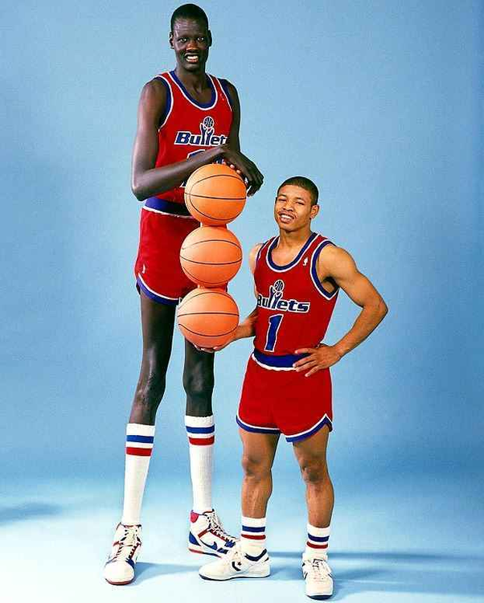
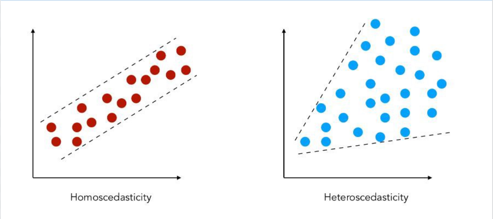

---
output:
  beamer_presentation:
    theme: "CambridgeUS"
    colortheme: "dolphin"
    fonttheme: "structurebold"
    df_print: kable
fontsize: 14pt
classoption: "aspectratio=169"
header-includes:
- \usepackage{caption}
- \captionsetup[figure]{labelformat=empty}
- \captionsetup[table]{labelformat=empty}
- \setbeamertemplate{page number in head/foot}[]{}
---

```{r, echo = FALSE, warning = FALSE, message = FALSE}
## Render the pdf
##rmarkdown::render(input = "./09_1-Simple_OLS.Rmd", output_file = "./09_1-Simple_OLS.pdf")

library(tidyverse)
library(readxl)
library(stargazer)
##library(kableExtra)
library(modelr)

knitr::opts_chunk$set(echo = FALSE,
                      eval = TRUE,
                      error = FALSE,
                      message = FALSE,
                      warning = FALSE,
                      comment = NA)
```


## Today's Agenda

\Large
Fitting, interpreting and analyzing simple OLS regressions

\vspace{.5in}

\normalsize
\begin{center}
Justin Leinaweaver (Fall 2021)
\end{center}


## Ordinary Least Squares (OLS) Regression
\large
\begin{center}
Ordinary least squares is a method for estimating a linear relationship between predictor variables (X) and an outcome (Y).

\vspace{.2in}

\Huge

Y = $\alpha$ + $\beta$ X
\end{center}


## Ross (1990) ICPSR Survey
\small
```{r, echo = FALSE}
## Input data and mutate
d <- read_excel("./Data/ICPSR_Ross_Survey_1990.xlsx", na = "NA") %>%
    mutate(
        Gender = if_else(male == 1, "Male", "Female"),
        Ethnicity2 = factor(ethnicity),
        Ethnicity2 = relevel(Ethnicity2, "White")
    )

## View the data
d |> slice(1:7) |> select(height:education, exercise, age)
```
\Large
\begin{center}
Nationally representative survey of approximately 1,800 respondents
\end{center}


## Outcome to Explain: Weight (lbs)
\footnotesize
```{r}
d$weight[1:270]
```

## Univariate Analysis: Weight (lb)
```{r, fig.align = 'center', fig.asp=0.618, out.height = '60%', fig.width = 4.5}
ggplot(data = d, aes(x = weight)) +
    geom_histogram(bins = 10, color = "white") +
    theme_minimal() +
    labs(x = "Weight (lbs)", y = "")
```

```{r, echo = FALSE}
summary(d$weight)
```


## Model 1: Weight Only
::: columns
:::: column
```{r, fig.align = 'center', fig.asp=0.7, out.height = '70%', fig.width = 4.5}
ggplot(data = d, aes(x = weight)) +
    geom_histogram(bins = 10, color = "white") +
    theme_minimal() +
    labs(x = "Weight (lbs)", y = "") +
    geom_vline(xintercept = 156, color = "red", size = 1.5)
```
::::
:::: column
\vspace{.75in}
```{r, echo = TRUE}
## The Sample Mean
mean(d$weight, na.rm = TRUE)
```
::::
:::


## Model 1: Sample Mean vs OLS Regression
::: columns
:::: column

\vspace{.75in}
```{r, echo = TRUE}
## The Sample Mean
mean(d$weight, na.rm = TRUE)
```
::::
:::: column
\begin{center}
```{r, echo = FALSE, results = "asis"}
model1 <- lm(data = d, weight ~ 1)

stargazer(model1, type = "latex", digits = 2, header = FALSE, dep.var.caption = "", dep.var.labels = "Weight (lb)", covariate.labels = c("Constant"), star.cutoffs = .05, notes = "*p < 0.05", notes.append = FALSE, omit.stat = c("rsq", "ser"), font.size = "small", float = FALSE)
```
\end{center}
::::
:::
\vspace{.2in}
\large
\begin{center}
Y = 156.29
\end{center}


## Model 1: Sample Mean vs OLS Regression
::: columns
:::: column

\vspace{.75in}
```{r, echo = TRUE}
## The Sample Mean
mean(d$weight, na.rm = TRUE)
```
::::
:::: column
\begin{center}
```{r, echo = FALSE, results = "asis"}
stargazer(model1, type = "latex", digits = 2, header = FALSE, dep.var.caption = "", dep.var.labels = "Weight (lb)", covariate.labels = c("Constant"), star.cutoffs = .05, notes = "*p < 0.05", notes.append = FALSE, omit.stat = c("rsq", "ser"), font.size = "small", float = FALSE)
```
\end{center}
::::
:::
\vspace{.2in}
\large
\begin{center}
Weight = 156.29
\end{center}


## Model 2: Using gender to model weight
\small
```{r, echo = FALSE}
## View the data
d |> slice(1:10) |> select(weight, male)
```


## Model 2: Using gender to model weight
::: columns
:::: column
```{r, fig.align = 'center', fig.asp=0.8, out.height = '75%', fig.width = 4.5}
ggplot(data = d, aes(x = factor(male), y = weight)) +
    geom_boxplot() +
    theme_minimal() +
    labs(x = "", y = "Weight (lbs)") +
    scale_x_discrete(labels = c("Female", "Male"))
```
::::
:::: column
\vspace{.4in}
```{r, echo = FALSE}
d |>
    mutate(
        Gender = if_else(male == 1, "Male", "Female")
    ) |>
    group_by(Gender) |>
    summarize(Mean = round(mean(weight, na.rm = TRUE), 1))

```
::::
:::


## Model 2: Group Means vs OLS Regression
::: columns
:::: column
\vspace{.4in}
```{r, echo = FALSE}
d |>
    mutate(
        Gender = if_else(male == 1, "Male", "Female")
    ) |>
    group_by(Gender) |>
    summarize(Mean = round(mean(weight, na.rm = TRUE), 1))

```
::::
:::: column
\begin{center}
```{r, echo = FALSE, results = "asis"}
model2 <- lm(data = d, weight ~ male)

stargazer(model2, type = "latex", digits = 2, header = FALSE, dep.var.caption = "", dep.var.labels = "Weight (lb)", covariate.labels = c("Male"), star.cutoffs = .05, notes = "*p < 0.05", notes.append = FALSE, omit.stat = c("rsq", "ser", "f"), font.size = "footnotesize", float = FALSE) 
```
\end{center}
::::
:::
\large
\begin{center}
Y = $\alpha$ + $\beta$ (X)
\end{center}


## Model 2: Group Means vs OLS Regression
::: columns
:::: column
\vspace{.4in}
```{r, echo = FALSE}
d |>
    mutate(
        Gender = if_else(male == 1, "Male", "Female")
    ) |>
    group_by(Gender) |>
    summarize(Mean = round(mean(weight, na.rm = TRUE), 1))

```
::::
:::: column
\begin{center}
```{r, echo = FALSE, results = "asis"}
model2 <- lm(data = d, weight ~ male)

stargazer(model2, type = "latex", digits = 2, header = FALSE, dep.var.caption = "", dep.var.labels = "Weight (lb)", covariate.labels = c("Male"), star.cutoffs = .05, notes = "*p < 0.05", notes.append = FALSE, omit.stat = c("rsq", "ser", "f"), font.size = "footnotesize", float = FALSE) 
```
\end{center}
::::
:::
\large
\begin{center}
Weight = 143.6 + 33.66 (Male)
\end{center}


## Model 2: Group Means vs OLS Regression
::: columns
:::: column
\vspace{.4in}
```{r, echo = FALSE}
d |>
    mutate(
        Gender = if_else(male == 1, "Male", "Female")
    ) |>
    group_by(Gender) |>
    summarize(Mean = round(mean(weight, na.rm = TRUE), 1))

```
::::
:::: column
\begin{center}
```{r, echo = FALSE, results = "asis"}
model2 <- lm(data = d, weight ~ male)

stargazer(model2, type = "latex", digits = 2, header = FALSE, dep.var.caption = "", dep.var.labels = "Weight (lb)", covariate.labels = c("Male"), star.cutoffs = .05, notes = "*p < 0.05", notes.append = FALSE, omit.stat = c("rsq", "ser", "f"), font.size = "scriptsize", float = FALSE) 
```
\end{center}
::::
:::
\begin{itemize}
\item Weight = 143.6 + 33.66 (Male = 0) = 143.6 lb
\item Weight = 143.6 + 33.66 (Male = 1) = 177.3 lb
\end{itemize}


## Model 3: Using ethnicity to model weight
\small
```{r, echo = FALSE}
## View the data
d |> slice(1:10) |> select(weight, ethnicity)
```


## Model 3: Using ethnicity to model weight
::: columns
:::: column
```{r, fig.align = 'center', fig.asp=0.8, out.height = '75%', fig.width = 4.5}
ggplot(data = d, aes(x = ethnicity, y = weight)) +
    geom_boxplot() +
    theme_minimal() +
    labs(x = "", y = "Weight (lbs)")
```
::::
:::: column
\vspace{.4in}
```{r, echo = FALSE}
d |>
    group_by(Ethnicity2) |>
    summarize(Mean = round(mean(weight, na.rm = TRUE), 1)) |>
    ungroup() |>
    rename(Ethnicity = Ethnicity2)
```
::::
:::


## 
::: columns
:::: column
\begin{center}
```{r, echo = FALSE, results = "asis"}
##Model 3: Group Means vs OLS Regression
model3 <- lm(data = d, weight ~ Ethnicity2)

stargazer(model3, type = "latex", digits = 2, header = FALSE, dep.var.caption = "", dep.var.labels = "Weight (lb)", covariate.labels = c("Black", "Hispanic", "Other"), star.cutoffs = .05, notes = "*p < 0.05", notes.append = FALSE, omit.stat = c("rsq", "f", "ser"), font.size = "scriptsize", float = FALSE)
```
\end{center}
::::
:::: column
\vspace{.35in}
```{r, echo = FALSE}
d |>
    group_by(Ethnicity2) |>
    summarize(Mean = round(mean(weight, na.rm = TRUE), 1)) |>
    ungroup() |>
    rename(Ethnicity = Ethnicity2)
```
::::
:::
\large
\begin{center}
Y = $\alpha$ + $\beta$ (X)
\end{center}


## 
::: columns
:::: column
\begin{center}
```{r, echo = FALSE, results = "asis"}
##Model 3: Group Means vs OLS Regression
model3 <- lm(data = d, weight ~ Ethnicity2)

stargazer(model3, type = "latex", digits = 2, header = FALSE, dep.var.caption = "", dep.var.labels = "Weight (lb)", covariate.labels = c("Black", "Hispanic", "Other"), star.cutoffs = .05, notes = "*p < 0.05", notes.append = FALSE, omit.stat = c("rsq", "f", "ser"), font.size = "scriptsize", float = FALSE)
```
\end{center}
::::
:::: column
\vspace{.35in}
```{r, echo = FALSE}
d |>
    group_by(Ethnicity2) |>
    summarize(Mean = round(mean(weight, na.rm = TRUE), 1)) |>
    ungroup() |>
    rename(Ethnicity = Ethnicity2)
```
::::
:::
\vspace{.1in}
\begin{center}
Weight = 156.45 + 3.66(Black) - 4.41(Hisp) - 13.34(Other)
\end{center}


## 
::: columns
:::: column
\begin{center}
```{r, echo = FALSE, results = "asis"}
##Model 3: Group Means vs OLS Regression
stargazer(model3, type = "latex", digits = 2, header = FALSE, dep.var.caption = "", dep.var.labels = "Weight (lb)", covariate.labels = c("Black", "Hispanic", "Other"), star.cutoffs = .05, notes = "*p < 0.05", notes.append = FALSE, omit.stat = c("rsq", "f", "ser"), font.size = "scriptsize", float = FALSE)
```
\end{center}
::::
:::: column
\vspace{.35in}
```{r, echo = FALSE}
d |>
    group_by(Ethnicity2) |>
    summarize(Mean = round(mean(weight, na.rm = TRUE), 1)) |>
    ungroup() |>
    rename(Ethnicity = Ethnicity2)
```
::::
:::
\vspace{.1in}
\begin{center}
156.45 + 3.66(Black=1) - 4.41(Hisp=0) - 13.34(Other=0) = 160.1 lb
\end{center}


## Model 4: Using height to model weight
\small
```{r, echo = FALSE}
## View the data
d |> slice(1:10) |> select(weight, height)
```


## Model 4: Using height to model weight
::: columns
:::: column
```{r, fig.align = 'center', fig.asp=0.8, out.height = '75%', fig.width = 4.5}
ggplot(data = d, aes(x = height, y = weight)) +
    geom_point() +
    theme_minimal() +
    labs(x = "Height (in)", y = "Weight (lbs)")
```
::::
:::: column
\vspace{.2in}
```{r, echo = FALSE}
d |>
mutate(
    Height2 = cut(height, breaks = 5, include.lowest = TRUE, right = FALSE)
) |>
group_by(Height2) |>
    summarize(Mean = round(mean(weight, na.rm = TRUE), 1)) |>
slice(1:8)
```
::::
:::


## Model 4: OLS Regression
::: columns
:::: column
\begin{center}
```{r, echo = FALSE, results = "asis"}
model4 <- lm(data = d, weight ~ height)

stargazer(model4, type = "latex", digits = 2, header = FALSE, dep.var.caption = "", dep.var.labels = "Weight (lb)", covariate.labels = c("Height"), star.cutoffs = .05, notes = "*p < 0.05", notes.append = FALSE, omit.stat = c("rsq", "f", "ser"), font.size = "footnotesize", float = FALSE) 
```
\end{center}
::::
:::: column
```{r, fig.align = 'center', fig.asp=0.85, out.height = '70%', fig.width = 5}
ggplot(data = d, aes(x = height, y = weight)) +
    geom_point(alpha = .4) +
    geom_smooth(method = "lm", se = FALSE) +
    theme_bw() +
    labs(x = "Height (in)", y = "Weight (lbs)")
```
::::
:::
\large
\begin{center}
Y = $\alpha$ + $\beta$ (X)
\end{center}


## 
::: columns
:::: column
\begin{center}
```{r, echo = FALSE, results = "asis"}
stargazer(model4, type = "latex", digits = 2, header = FALSE, dep.var.caption = "", dep.var.labels = "Weight (lb)", covariate.labels = c("Height"), star.cutoffs = .05, notes = "*p < 0.05", notes.append = FALSE, omit.stat = c("rsq", "f", "ser"), font.size = "footnotesize", float = FALSE) 
```
\end{center}
::::
:::: column
```{r, fig.align = 'center', fig.asp=0.9, out.height = '75%', fig.width = 5}
ggplot(data = d, aes(x = height, y = weight)) +
    geom_point(alpha = .4) +
    geom_smooth(method = "lm", se = FALSE) +
    theme_bw() +
    labs(x = "Height (in)", y = "Weight (lbs)")
```
::::
:::
\large
\begin{center}
Weight = -173.26 + 4.95 (Height)
\end{center}


## 
::: columns
:::: column
\begin{center}
```{r, echo = FALSE, results = "asis"}
stargazer(model4, type = "latex", digits = 2, header = FALSE, dep.var.caption = "", dep.var.labels = "Weight (lb)", covariate.labels = c("Height"), star.cutoffs = .05, notes = "*p < 0.05", notes.append = FALSE, omit.stat = c("rsq", "f", "ser"), font.size = "footnotesize", float = FALSE) 
```
\end{center}
::::
:::: column
```{r, fig.align = 'center', fig.asp=0.9, out.height = '75%', fig.width = 5}
ggplot(data = d, aes(x = height, y = weight)) +
    geom_point(alpha = .4) +
    geom_smooth(method = "lm", se = FALSE) +
    annotate("point", x = 60, y = 124, size = 8, color = "red") +
    theme_bw() +
    labs(x = "Height (in)", y = "Weight (lbs)")
```
::::
:::
\large
\begin{center}
Weight = -173.26 + 4.95 (60) = 124 lb
\end{center}


## 
::: columns
:::: column
\begin{center}
```{r, echo = FALSE, results = "asis"}
stargazer(model4, type = "latex", digits = 2, header = FALSE, dep.var.caption = "", dep.var.labels = "Weight (lb)", covariate.labels = c("Height"), star.cutoffs = .05, notes = "*p < 0.05", notes.append = FALSE, omit.stat = c("rsq", "f", "ser"), font.size = "footnotesize", float = FALSE)
```
\end{center}
::::
:::: column
```{r, fig.align = 'center', fig.asp=0.9, out.height = '75%', fig.width = 5}
ggplot(data = d, aes(x = height, y = weight)) +
    geom_point(alpha = .4) +
    geom_smooth(method = "lm", se = FALSE) +
    annotate("point", x = 72, y = 183, size = 8, color = "red") +
    theme_bw() +
    labs(x = "Height (in)", y = "Weight (lbs)")
```
::::
:::
\large
\begin{center}
Weight = -173.26 + 4.95 (72) = 183 lb
\end{center}


## Fitting OLS Regressions in R
\large
```{r, echo = TRUE, eval = FALSE}
## Fitting an OLS model
model1 <- lm(data = ?, outcome ~ predictor)

## Check the Results
summary(model1)

## Fancier tables?
## See today's readings using stargazer
```


## 1. Is it logical?
::: columns
:::: column
\begin{center}
```{r, echo = FALSE, results = "asis"}
stargazer(model4, type = "latex", digits = 2, header = FALSE, dep.var.caption = "", dep.var.labels = "Weight (lb)", covariate.labels = c("Height"), star.cutoffs = .05, notes = "*p < 0.05", notes.append = FALSE, omit.stat = c("rsq"), font.size = "footnotesize", float = FALSE) 
```
\end{center}
::::
:::: column
```{r, fig.align = 'center', out.height = '80%'}

```
::::
:::


## 2. Are the coefficients significant?
::: columns
:::: column
\begin{center}
```{r, echo = FALSE, results = "asis"}
stargazer(model4, type = "latex", digits = 2, header = FALSE, dep.var.caption = "", dep.var.labels = "Weight (lb)", covariate.labels = c("Height"), star.cutoffs = .05, notes = "*p < 0.05", notes.append = FALSE, omit.stat = c("rsq"), font.size = "footnotesize", float = FALSE) 
```
\end{center}
::::
:::: column
```{r, fig.align = 'center', fig.asp=0.75, out.height = '70%', fig.width = 5}
ggplot(data = d, aes(x = height, y = weight)) +
    geom_point(alpha = .4) +
    geom_hline(yintercept = 156, color = "red", size = 1.3) +
    geom_smooth(method = "lm", se = FALSE, size = 1.4) +
    theme_bw() +
    labs(x = "Height (in)", y = "Weight (lbs)")
```
::::
:::


## 3. How high is an adjusted R$^2$ of 0.30?
```{r, fig.align = 'center', fig.asp = 0.618, fig.width = 7, out.height = '85%'}
set.seed(50)
d1 <- tibble(
    x = rnorm(50, 12, 3),
    y1 = x + rnorm(50, 15, 8),
    y2 = x + rnorm(50, 15, 5),
    y3 = x + rnorm(50, 15, 1.5),
    y4 = x + rnorm(50, 15, .5)    
)

## round(summary(lm(data = d1, y1 ~ x))$adj, 2)
## round(summary(lm(data = d1, y2 ~ x))$adj, 2)
## round(summary(lm(data = d1, y3 ~ x))$adj, 2)
## round(summary(lm(data = d1, y4 ~ x))$adj, 2)

d2 <- d1 |>
pivot_longer(cols = y1:y4, names_to = "Version", values_to = "Values") |>
mutate(
    Version = case_when(
        Version == "y1" ~ "R2 = 0",
        Version == "y2" ~ "R2 = 0.24",
        Version == "y3" ~ "R2 = 0.81",
        Version == "y4" ~ "R2 = 0.97")
    )

ggplot(data = d2, aes(x = x, y = Values)) +
    geom_point() +
    geom_smooth(method = "lm", se = FALSE) +
    theme_bw() +
    facet_wrap(~ Version)

```


## 4. Any problems in the residuals plot?
```{r, fig.align = 'center', fig.asp=0.75, out.height = '85%', fig.width = 5}
d |>
    add_residuals(model4) |>
    add_predictions(model4) |>
    ggplot(aes(x = pred, y = resid)) +
    geom_point() +
    geom_hline(yintercept = 0, color = "red") +
    labs(x = "Model 4 Fitted Values", y = "Model 4 Residuals") +
    theme_bw()
```


## Heteroskedastic Errors are Bad
```{r, fig.align = 'center', out.height = '80%'}

```

## Non-Linear Errors are Bad
```{r, fig.align = 'center', out.height = '80%'}
knitr::include_graphics("./Images/09_1-nonlinear_errors.png")
```

## 4. Any problems in the residuals plot?
```{r, fig.align = 'center', fig.asp=0.75, out.height = '85%', fig.width = 5}
d |>
    add_residuals(model4) |>
    add_predictions(model4) |>
    ggplot(aes(x = pred, y = resid)) +
    geom_point() +
    geom_hline(yintercept = 0, color = "red") +
    labs(x = "Model 4 Fitted Values", y = "Model 4 Residuals") +
    theme_bw()
```

## Evaluating the Fit of an OLS Regression
\Large
\begin{enumerate}
\item Is it logical?
\vspace{.1in}
\item Are the coefficients significant?
\vspace{.1in}
\item How high is the adjusted R$^2$
\vspace{.1in}
\item Any problems in the residuals plot?
\end{enumerate}


