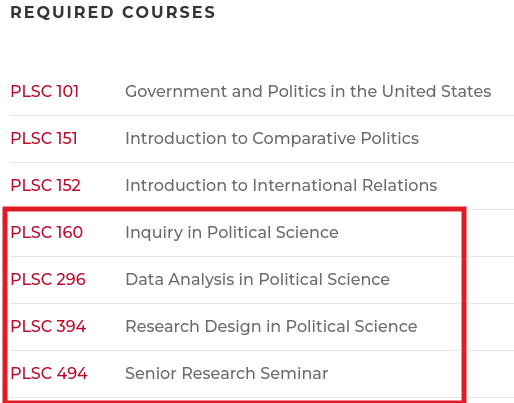
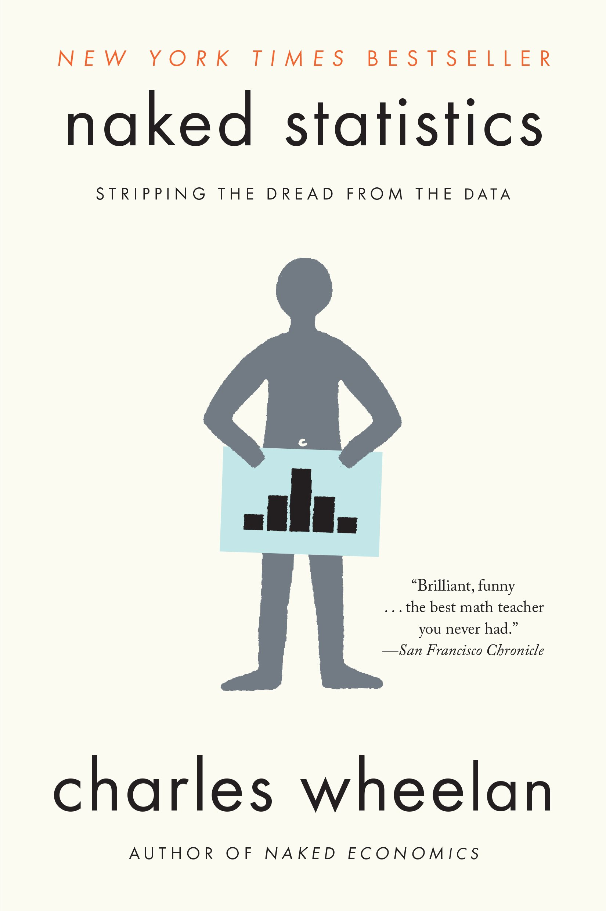
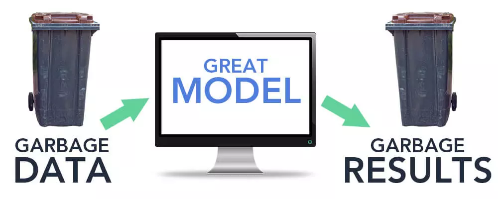
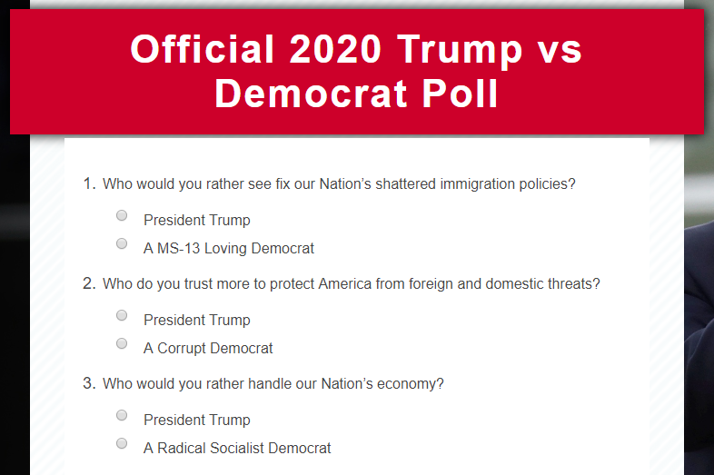
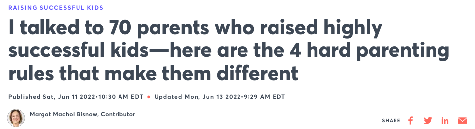
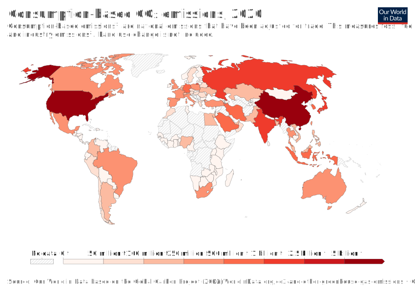
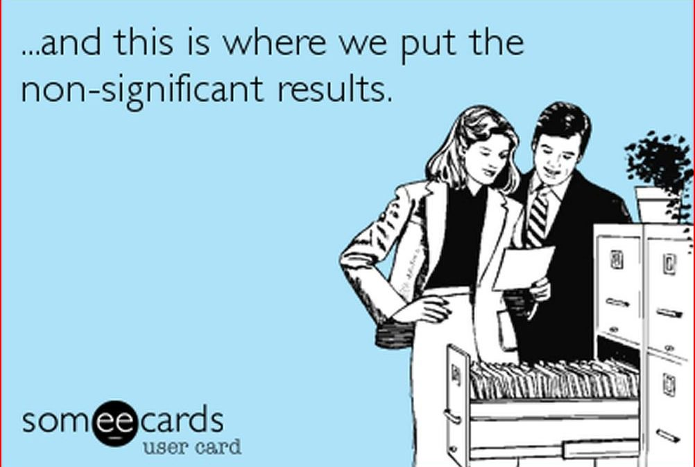
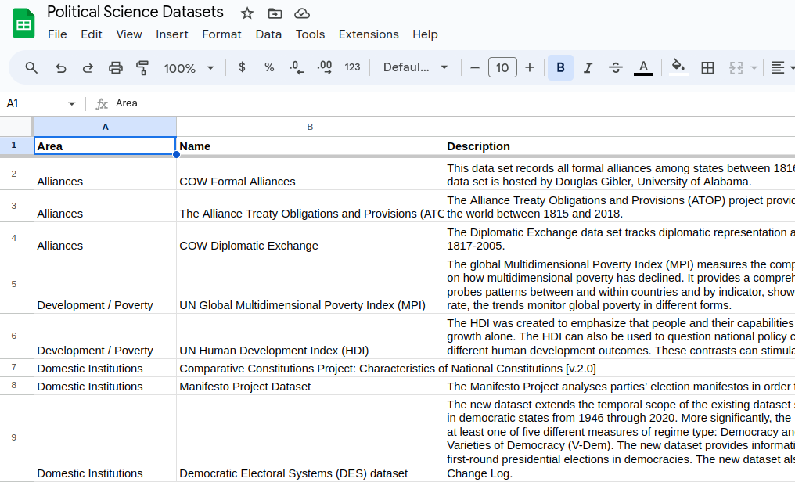
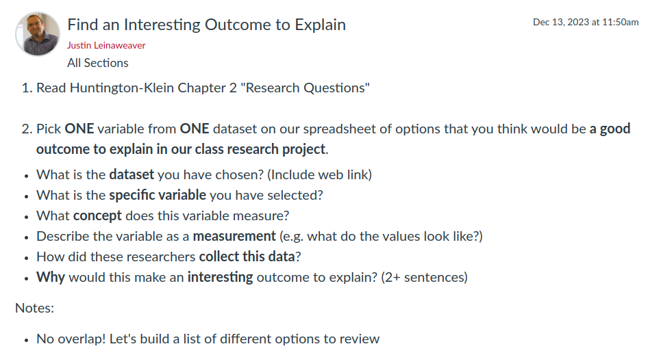

## Today's Agenda {background-image="Images/background-data_blue_v4.png"}

```{r}
library(tidyverse)
library(readxl)
library(kableExtra)
library(modelsummary)
```

<br>

<br>

1. Review your puzzles

2. Introduce our data options

<br>

<br>

::: r-stack
Justin Leinaweaver (Spring 2025)
:::

::: notes
Prep for Class

1. Review Canvas submissions

2. Try to save time at end of class to explore the data options spreadsheet

3. Links for today
    - [Huntington-Klein 2022 chapter 1 "Designing Research"](https://theeffectbook.net/ch-TheDesignofResearch.html)
    - Wheelan chapter 7 "The Importance of Data"
    - [Link to Data Sets Spreadsheet](https://docs.google.com/spreadsheets/d/1qOBt2M_yoIkeeuw6x3MMBMjEQsPquGDDkWUYF-aNtBo/edit#gid=0)
    
:::

    

## For Today {background-image="Images/background-slate_v2.png" .center}

<br>

1. Huntington-Klein (2022) Chapter 1 "Designing Research"

<br>

2. Wheelan (2014) Chapter 7 "The Importance of Data"

::: notes

The readings I assigned you for today are designed to set the table for our semester.

<br>

### Does everyone have the Wheelan book?

- A very useful reference for those new to the world of statistics

- Wheelan focuses on the intuitions underpinning the statistical methods and provides examples of when you would use each of the tools in the real world

- I really appreciate how accessible this book is and I don't want you to underestimate the value of learning statistics at an intuitive level before tackling the math

<br>

We'll rely on the Huntington-Klein book, among others, for guidance on research design and using data to answer questions.

- Not a ton in chapter 1 that we need to analyze deeply, that will come with the next chapter.

- **SLIDE**: But there is at least one super important idea for our semester so let's highlight it.

:::


## "Required Courses" in Poli Sci {background-image="Images/background-slate_v2.png" .center}

<br>

```{r, fig.align = 'center'}

```

::: notes

First, let's talk required courses!

<br>

Here is a list of the required courses for our major

- This is "the spine" of the major

- The first three courses introduce you to different "area" specializations (e.g. US pols, comparative and IR)

- BUT, more than half of the required courses focus on training you to be a social scientist

<br>

A big part of 160 was designed to help you think like a political scientist.

- e.g. How do we ask useful research questions?

- What kinds of questions do we tend to ask in political science? 

- How have researchers answered these questions in the literature?

- What are the components of a "good" answer to a research question (theory, design, data, etc)?

<br> 

My job this semester is to continue your training along these lines

- Specifically, I will train you to answer important questions with observations from the real-world (aka data)

- This will require you to develop skills in both data analysis (statistics) and data science (programming and visualization)

<br>

However, playing with the data is only useful if we get the research design piece right!

- Research design is the process by which we learn how to connect research questions with data

- **SLIDE**: And the thing about research design is...

:::


## {background-image="Images/background-slate_v2.png" .center}

::: {.r-fit-text}
"Research design is hard..."
:::

::: notes

Ok, I know this doesn't strike you as a deep insight, but humor me!

- Huntington-Klein makes this point really well in chapter 1 and we need to make sure we understand it

:::


## {background-image="Images/background-slate_v2.png" .center}

"Research design is hard, and just because you want to answer a question doesn’t mean there’s necessarily a straightforward way of doing it. 

<br>

But the worst that could happen is that we’d figure out that the answer will be difficult to get. Then, at least, we’ll know.

<br>

The best that could happen is that we can answer our question. And we do. And then we win a Nobel prize" (Huntington-Klein Chapter 1).

::: notes

As I hope we started to see last week with our warm-up activities, using data to answer a question means having to grapple with measurement. 

- And thinking critically about measurement means thinking VERY carefully about the kinds of questions we can and cannot answer.

<br>

Many people seem to think that you need fancy statistics knowledge to unpack quantitative research.

- The media especially seems quite infatuated with the illusion of certainty provided by numbers.

<br>

**One of our key lessons this semester is to note that the research design in ANY project is WAY more important than the statistics!**

- There are tons of "answers" out there, my job is to help you develop the tools to interpret the usefulness of those answers.

<br>

### Any questions on the first chapter of the Huntington-Klein book?

- As I said, very much setting the table for the work to come.

:::


## {background-image="Images/background-slate_v2.png" .center}

:::: {.columns}
::: {.column width="45%"}
```{r, echo = FALSE, fig.align = 'left'}

```
:::

::: {.column width="55%"}

<br>

**Chapter 7**

<br>

"The Importance of Data"

<br>

aka

<br>

"Garbage in, Garbage out"
:::
::::

::: notes

Let's now jump over to the Wheelan book.

- This chapter is all about the importance of data quality

<br>

### Can anybody explain what "garbage in, garbage out" means?

- (**SLIDE**)

:::


## Wheelan (2014) Chapter 7 {background-image="Images/background-slate_v2.png" .center}

<br>

```{r, echo = FALSE, fig.align = 'center'}

```

::: notes

"Garbage in, garbage out" is a reminder that no amount of fancy stats, visualizations or verbal gymnastics can save a research project if the data is crap

- If the data is bad, your conclusions will be too

<br>

Important to note that this is a WAY more common problem than you might realize

- As the examples in this chapter make clear, this is true of so much of the "news" we are bombarded with

<br>

I like starting our work on research design with this Wheelan chapter because of its focus on what can go wrong

- Building a good research design or data measurement is hard, but screwing one up with the examples in this chapter is easy

<br>

So, let's step through these red flags so we can be on the lookout for them in other peoples' research designs and so we can avoid including them in our own research designs

- **SLIDE**: Let's start with some of the risks of using survey data

:::


## Some Data is Hot Garbage {background-image="Images/background-slate_v2.png" .center}

```{r, echo = FALSE, fig.align = 'center', out.width = '80%'}

```

::: notes

Red Flag Number 1: Some Data is Hot Garbage

<br>

Ok, Wheelan doesn't actually include this one but I'd be remiss if we didn't start with it.

- Some data is obviously hot garbage with no redeeming value.

- Technically this is "data," just not useful for anything serious

- These kinds of push polls are used to generate fundraising contributions not measure anything serious.

<br>

While this is clearly absurd, the "hot garbage" problem is often far subtler in execution

- **SLIDE**: Let me show you some more subtle examples that produce problematic data

:::


## Problems in Survey Design {background-image="Images/background-slate_v2.png" .center}

**Leading Questions**

<br>

- How worried are you about inflation?

<br>

- How strongly do you want the Biden administration to support Israel in its fight against terrorism?

::: notes

Red Flag Number 2: Leading Questions Distort the Responses

<br>

Leading questions: "a question that prompts or encourages the desired answer."

- Often designed this way with the best of intentions, but this style of question pushes a specific reference into the mind of the respondent and ruins the data

<br>

**SLIDE**: Better version

:::


## Problems in Survey Design {background-image="Images/background-slate_v2.png" .center}

**Leading Questions**

<br>

- How strongly do you want the Biden administration to support Israel in its fight against terrorism?

<br>

- Do you support or oppose the Biden administration's policies towards Israeli actions in Gaza?

::: notes

You will be "shocked" to discover that these questions increase the proportion of respondents saying they "worry about inflation" and "support Israel" from non-leading versions

<br>

The problem is that the results get reported without mentioning the question wording!

- When was the last time you were told a survey result and asked to see the question for yourself?

:::


## Problems in Survey Design {background-image="Images/background-slate_v2.png" .center}

**Double-barreled Questions**

<br>

- Do you approve or disapprove of President Biden's handling of inflation and the economy?

<br>

- How likely are you to buy or lease a new car this year?

::: notes

Red Flag Number 3: Double-barreled Questions confuse the respondents

<br>

- "a question that essentially includes more than one topic and is asking about two different issues, while only allowing a single answer."

<br>

Again, the respondent is at a loss for which part of the question to answer, and yet, the results are often reported as clear and unambiguous.

- Isn't it possible to be mad about inflation and happy about economic growth and low unemployment?

<br>

Easy fix, split the questions!

:::


## Problems in Survey Design {background-image="Images/background-slate_v2.png" .center}

**Problem Framing**

<br>

- Do you support oil drilling in the Arctic Wildlife National Refuge?

<br>

- Do you support oil exploration in the Arctic Wildlife National Refuge?

::: notes

Red Flag Number 4: Framing manipulates opinion

<br>

The most subtle version of screwing around with a survey question is in simple framing.

- e.g. describing an issue in a light designed to appeal to your audience.

<br>

THIS is by far the most common "trick" embraced by "researchers" aiming to control the results of a survey

- Anybody want to guess which question gets more support from the public?

- Drilling is dirty and dangerous, but exploration means we're explorers! 

<br>

What does all of this mean for us as researchers who might use survey data?

- Unless you review the survey instrument you really shouldn't interpret the results

<br>

Let's now hit one of the data problems discussed in the Wheelan book

### Per the reading, what is selection bias?
- (occurs when individuals or groups in a study differ systematically from the population of interest leading to a systematic error in an association or outcome.)

<br>

### Can anybody explain it more simply?

:::


## Selection Bias {background-image="Images/background-slate_v2.png" .center}

:::: {.columns}
::: {.column width="10%"}

:::

::: {.column width="80%"}
```{r, echo = FALSE, fig.align = 'center'}

```

```{r, echo = FALSE, fig.align = 'center'}

```
:::

::: {.column width="10%"}

:::
::::

::: notes

Red Flag Number 5: Make sure the sample represents the population!

<br>

Here are two examples from the seeming hundred of these types of articles published on the web daily.

### Why can't you rely on the findings from these kinds of articles?

<br>

The sample being studied here (e.g. billionaires or parents of successful kids) are not the groups you want to learn about!

- The implied point of the article is that YOU can become rich or a better parent if you do these simple things

- Finding out that 10 billionaires all meditate in the morning or eat oatmeal DOES NOT MEAN that if we simple folk do the same we'll become rich

- Studying 1000 people of various levels of wealth and discovering that one habit correlates with wealth might be something!

<br>

### How do we avoid this problem in our own research?

1. Make sure the sample you are studying is representative of the population you are interested in
    - Make sure your data sample reflects that whole population

2. Be VERY careful when asking questions that focus on subsets of a population
    - You might accidentally be introducing selection bias into your data.
    
3. Make sure to study your observations that are missing data!
    - Do the people or countries missing data look different from the rest of the sample? That's a bad sign!
    - In other words, even if your sample includes 1,000 people of different levels of wealth, if none of the poor respondents answered your question then the data has selection bias!
    
<br>

**SLIDE**: Let's dig into this third one...

:::


## Survivorship Bias {background-image="Images/background-slate_v2.png" .center}

<br>

```{r, echo = FALSE, fig.align = 'center'}
knitr::include_graphics("Images/02_3-Survivorship-bias.png")
```

::: notes

Out of chapter order, but since survivorship bias IS a form of selection bias let's discuss it now.

### Per the reading, what is Survivorship Bias?
- (Survivorship bias or survival bias is the logical error of concentrating on entities that passed a selection process while overlooking those that did not.)

- (Survivorship bias is a type of sample selection bias that occurs when an individual mistakes a visible successful subgroup as the entire group.)

<br>

Red Flag Number 6: Think carefully about how your data was generated! 

<br>

### Anybody seen this famous figure before? Know the story of it?

- Long story very short, during WWII the US was focused on finding ways to reduce aircraft casualties
    - e.g. Too many planes getting shot down

- This diagram represents the most common damage observed on planes that made it back to base.
    - The US military’s conclusion was simple: Since the wings and tail are obviously vulnerable to receiving bullets we need to increase the armor on them
    
<br>

### Why is this a mistaken conclusion? Anybody know this story?

- The statistician Abraham Wald stepped in and stopped this nonsense.

- Clearly this diagram shows us that bullet holes in the wings and tail DON'T stop the pilots from getting home safely!
    - These diagrams were made based ONLY on the planes that made it home!
    - We don't know what the bullet hits look like on the planes that were shot down!

- Wald saw this diagram and concluded the armor was needed on the engines!

<br>

Survivorship Bias in action!

- The sample here ONLY included the planes that made it home safely, NOT the ones shot down.

- "In other words what their diagram of bullet holes actually showed was the areas their planes could sustain damage and still be able to fly and bring their pilots home" [LINK](https://mcdreeamiemusings.com/blog/2019/4/1/survivorship-bias-how-lessons-from-world-war-two-affect-clinical-research-today).

:::


## Selection / Survivorship Bias {background-image="Images/background-slate_v2.png" .center}

<br>

```{r, echo = FALSE, fig.align = 'center'}

```

::: notes

Because this is a form of the selection bias problem we talked about before we still rely on the fixes we just talked about.

- HOWEVER, I include this to reinforce its importance in your minds and to warn you that this bias sneaks in EVERYWHERE!

<br>

I have often heard people speak conclusively about which countries emit the most CO2 into the atmosphere and in very specific amounts.
- This map is designed to help us think about those emissions and how trade influences them

- In other words, do richer countries look "cleaner" because they are outsourcing polluting factories to poor countries.

<br>

### This is an incredibly important question but what is one of the biggest obstacles to answering it?
- (We have almost ZERO data on the countries of Africa!)

I'm not asking you to pretend Africa is the problem in this climate change problem, BUT how do we answer questions about pollution outsourcing if we lack an entire continent's worth of data::: notes

<br>

The world is a messy place and we almost never have data on a completely representative sample.

- Often our samples exclude poor countries and peoples.

<br>

You have to be careful when drawing out big conclusions using samples missing specific types of people, places or thing.

### Make sense?

<br>

### According to Wheelan, what is publication bias?

- (**SLIDE**)

:::


## Publication Bias {background-image="Images/background-slate_v2.png" .center}

<br>

```{r, echo = FALSE, fig.align = 'center'}
knitr::include_graphics("Images/02_3-publication_bias1.png")
```

::: notes

Publication bias: Studies with crazy or unexpected findings more likely to get published.

<br>

Red Flag Number 7: Be suspicious of findings that haven't been replicated or aren't consistent with other published research 

<br>

### How do we avoid this problem in our own research?

This is where robustness and validation checks prove so important.

- Unexpected findings can be very exciting because you are changing what we thought we knew about the world, HOWEVER...

- The more unexpected the result, the higher the burden is on YOU to show that your research design is not accidentally creating it,

- The more unexpected the result, the greater the need for you to show your findings replicate (new samples, new approaches), AND

- The more unexpected the result, the more important you can show that you are building using data that is consistent with other sources of the same things.

:::


## Publication Bias {background-image="Images/background-slate_v2.png" .center}

<br>

```{r, echo = FALSE, fig.align = 'center'}

```

::: notes

A second form of the publication bias problem is also known as the file drawer problem.

- Research with null results don't tend to get published so we don't hear about the studies showing no relationships.

- This means it's hard to evaluate research with strong findings because we don't know if others have found the opposite or no effect.

<br>

The most nefarious version of this is the researcher who runs ten tests and only reports the one that shows the key finding.

- This is, unfortunately, way too common in the world.

<br>

### According to Wheelan, what is recall bias?

- (**SLIDE**)

:::


## Recall Bias {background-image="Images/background-slate_v2.png" .center}

<br>

```{r, echo = FALSE, fig.align = 'center'}
knitr::include_graphics("Images/02_3-recall_bias.png")
```

::: notes

Recall Bias: A type of bias that occurs when participants in a research study or clinical trial do not accurately remember a past event or experience or leave out details when reporting about them.

<br>

This is probably the one form of data bias that has caused the biggest headaches for nutrition researchers across time.

- Short of imprisoning your subjects to ensure they only eat what you give them and in the amounts you are interested in, we are stuck with asking people about what they do

- e.g. How often do you eat garlic? How often do you exercise? etc

- Super problematic measures

<br>

### How do we avoid this problem in our own research?

<br>

Red Flag Number 8: Self-reported data is incredibly hard to rely upon.
- Peoples' memories are fallible and malleable!

- All the more important to reinforce these kinds of data with other research designs (controlled experiments) that allow external measurement in reliable ways.
:::


## {background-image="Images/background-slate_v2.png" .center}

```{r, echo = FALSE, fig.align = 'center'}

```

<br>

Survey Design Biases, Selection Bias, Publication Bias, Recall Bias, Survivorship Bias, Healthy User Bias, and more

::: notes

These are just some of the most common red flags we need to be aware of when working with or analyzing data.

<br>

### Any questions on these?

<br>

So, you've got some data that has some problems, does that mean it is useless?

- Not necessarily!

<br>

Go back to our discussion from week 1 when we measured your heights.

- In most cases, IFF we understand how a measure was derived, we can extract something useful from it.

- Even our attempts to measure the classes avg height gave us a confident enough result to know you all fit through the door!

<br>

**SLIDE**: All that said, let's start exploring some real world data!

:::


## {background-image="Images/background-slate_v2.png" .center}

```{r, echo = FALSE, fig.align = 'center'}

```

::: notes

On our Canvas Modules page is a link to a Google Sheet I've made that includes 50+ data projects with interesting topics and accessible datasets.

<br>

Our big job this semester is to build a research project using these sources

- In terms of that goal, Our first task is to pick one of these data projects as our key outcome to explain.

- e.g. the dependent variable for our class research project.

<br>

### Has everybody been able to access the link?

<br>

### Any questions on the set-up of the sheet?


:::


## {background-image="Images/background-slate_v2.png" .center}

```{r, echo = FALSE, fig.align = 'center'}

```

::: notes

For next class you have a reading and an assignment.

- The reading is meant to help you complete the assignment.

<br>

Take some time to actually visit the web page for the data project you select and build your argument for choosing this project based on the details of what you learned there. Take us deeper into why you believe this project is a good source of variation for us and cite details from the project itself. Tell us something cool about the specific measurements that sell us on why we should pick this project!"


<br>

### Questions on the assignment?

- Excellent! Get to it!
:::